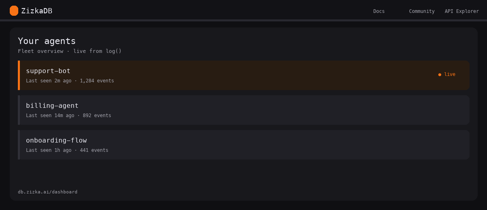
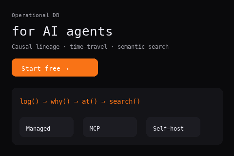
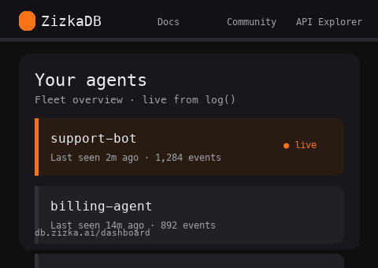
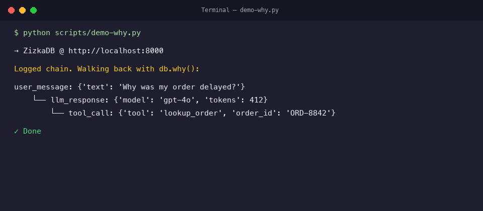
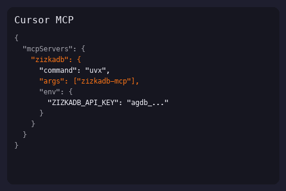
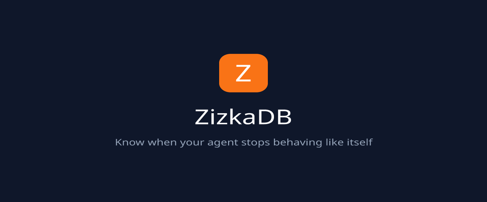
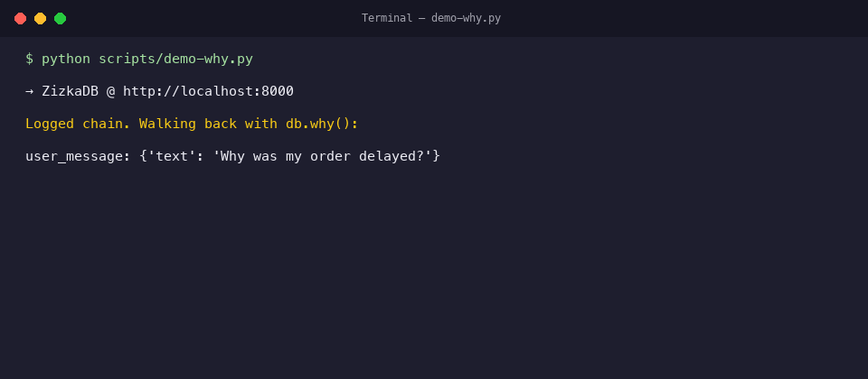

<div align="center">

# ZizkaDB

**The operational database for AI agents.**

[](LICENSE)
[](https://github.com/Zizka-ai/ZizkaDB/releases)
[](https://pypi.org/project/zizkadb-sdk/)
[](https://db.zizka.ai)

[Try it live](https://db.zizka.ai) · [Documentation](https://db.zizka.ai/docs) · [Architecture](https://db.zizka.ai/trust) · [Development](#development)

</div>

When an agent misbehaves in production, you need more than scattered traces and a vector index. **ZizkaDB** is one store for **causal lineage** (`why()`), **time-travel state** (`at()`), **semantic search**, and **fleet dashboards** — open source, self-hostable, and model-agnostic.

Log every decision with `parent_id`, walk backward to the root cause in one call, and ship the same SDK to managed cloud or your own Docker stack.

<p align="center">
  <a href="https://db.zizka.ai">
    
  </a>
</p>

<p align="center">
  <a href="https://db.zizka.ai"></a>
  <a href="https://db.zizka.ai/dashboard"></a>
  
  <a href="mcp/README.md"></a>
</p>

---

## Online viewer

**[db.zizka.ai](https://db.zizka.ai)** — managed cloud with signup, API keys (`zizkadb_live_...`), live dashboard (auto-refreshes every 30s), and billing. No credit card for the free tier.

<p align="center">
  
</p>

---

## `why()` — causal chain in the terminal

Self-host locally, then run the demo script. The SDK prints a tree from any `event_id` back to the root.

<p align="center">
  
</p>

```bash
bash scripts/setup-local.sh
pip install zizkadb-sdk
python scripts/demo-why.py
```

---

## Start a new agent project

```bash
pip install zizkadb-sdk
zizkadb init my-agent --template basic      # log + why()
zizkadb init my-agent --template langchain  # LangChain callbacks
zizkadb init my-agent --template crewai     # CrewAI logger
zizkadb init my-agent --template openai     # AsyncOpenAI + parent_id
zizkadb init my-agent --template mcp-cursor # Cursor MCP config
```

Framework adapters: [`integrations/`](integrations/) · runnable [`examples/`](examples/)

---

## Development

### Prerequisites

- **Docker** + Docker Compose v2
- **Python 3.10+** (for the demo script and SDK)
- Optional: **Node 18+** if you hack on `dashboard/`

### Installation (self-host, ~30 seconds)

```bash
git clone https://github.com/Zizka-ai/ZizkaDB.git && cd ZizkaDB
bash scripts/setup-local.sh
```

Or with Compose only:

```bash
cp .env.example infra/.env
docker compose -f infra/docker-compose.yml -f infra/docker-compose.dashboard.yml up -d
```

| Service | URL |
|---------|-----|
| API | http://localhost:8000/health |
| Swagger | http://localhost:8000/swagger |
| Dashboard | http://localhost:3001/login → **Open my dashboard →** |

### Run the demo

```bash
pip install zizkadb-sdk
python scripts/demo-why.py
```

Localhost uses an auto-injected dev key — no API key required.

### Managed cloud (same SDK)

```bash
pip install zizkadb-sdk
```

```python
import asyncio
from zizkadb import ZizkaDB

async def main():
    async with ZizkaDB("zizkadb_live_...") as db:  # https://db.zizka.ai/signup
        user = await db.log(agent="my-bot", event="user_message", data={"text": "..."})
        tool = await db.log(
            agent="my-bot", event="tool_call", data={"tool": "search"},
            parent_id=user.event_id,
        )
        (await db.why(tool.event_id)).print()

asyncio.run(main())
```

> PyPI: `zizkadb-sdk` · import: `from zizkadb import ZizkaDB` · pass **`event_id`** to `why()`, not the agent name.

### Production on a VPS

```bash
docker compose -f infra/docker-compose.yml up -d
bash infra/deploy-selfhost.sh
```

Configure `EMAIL_*` in `infra/.env` for team OTP login. On managed cloud set `ENV=production` and leave `DEV_API_KEY` unset. Full guide: [db.zizka.ai/docs](https://db.zizka.ai/docs).

### Refresh README assets

```bash
python scripts/generate-readme-assets.py
```

Re-record a cinematic terminal GIF: [docs/assets/RECORD_DEMO.md](docs/assets/RECORD_DEMO.md).

> Opt out of anonymous telemetry: `export ZIZKADB_TELEMETRY=false`

---

## What is ZizkaDB?

| Problem | Primitive |
|---------|-----------|
| Why did the agent do that? | `parent_id` → `why(event_id)` |
| What did it know at 2pm Tuesday? | `at(agent, timestamp)` |
| Find similar past failures | `search()` / `context_for()` |
| Is this agent drifting? | Baselines + fleet views |

**Not** a vector DB alone. **Not** traces alone. **Operational** data for agents in production.

---

## Integrate

| Path | Getting started |
|------|-----------------|
| **Scaffold** | `zizkadb init my-agent -t langchain` |
| Python | `pip install zizkadb-sdk` |
| LangChain | `pip install zizkadb-langchain` — [integrations/langchain](integrations/langchain) |
| CrewAI | `pip install zizkadb-crewai` — [integrations/crewai](integrations/crewai) |
| TypeScript | `npm install zizkadb-sdk` — [sdk/typescript](sdk/typescript) |
| MCP | `uvx zizkadb-mcp` — [mcp/README.md](mcp/README.md) |
| REST | OpenAPI at `/swagger` |

Self-host: `ZizkaDB(host="http://localhost:8000")` or `ZIZKADB_HOST` for MCP.

---

## License

- **API, dashboard, SDKs:** [AGPL-3.0](LICENSE)
- **MCP server:** [MIT](mcp/LICENSE)
