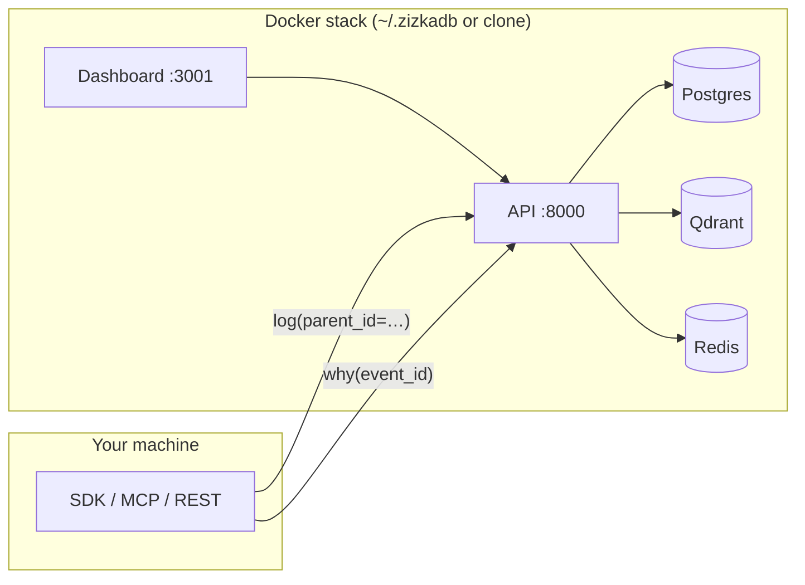
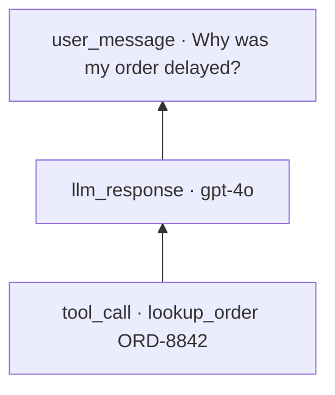
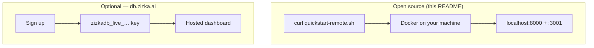

<div align="center">

# ZizkaDB

**Know why your agent did what it did.**

[](LICENSE)
[](https://github.com/Zizka-ai/ZizkaDB/releases)
[](https://pypi.org/project/zizkadb-sdk/)
[](https://www.npmjs.com/package/zizkadb-sdk)
[](https://pypi.org/project/zizkadb-mcp/)

**[Start in 60 seconds](#-start-in-60-seconds-no-repo-clone)** · [Docs](https://db.zizka.ai/docs) · [Wiki](https://github.com/Zizka-ai/ZizkaDB/wiki) · [CONNECT.md](CONNECT.md)

</div>

When an agent misbehaves, scattered logs are not enough. **ZizkaDB** stores **causal lineage** (`why()`), **time-travel state** (`at()`), **semantic search**, and a **fleet dashboard** — self-host on your laptop with Docker, or use the same SDK on managed cloud.

<p align="center">
  
</p>

---

## ⚡ Start in 60 seconds (no repo clone)

**You do not need to download this repository.** We pull pre-built Docker images and only fetch a few kilobytes of config.

```bash
curl -fsSL https://raw.githubusercontent.com/Zizka-ai/ZizkaDB/main/scripts/quickstart-remote.sh | bash
```

| What happens | Detail |
|--------------|--------|
| **Downloaded** | ~4 files → `~/.zizkadb/infra/` (compose, schema, env) |
| **Not downloaded** | Full git repo, source tree, or build toolchain |
| **Pulled** | `ghcr.io/zizka-ai/zizkadb-api` + `zizkadb-dashboard` + Postgres/Qdrant/Redis |
| **Runs** | `zizkadb demo` — support-bot order delay + `why()` tree |

| Service | URL |
|---------|-----|
| **Dashboard** | http://localhost:3001/login → **Open my dashboard →** |
| **API** | http://localhost:8000/health |
| **Swagger** | http://localhost:8000/swagger |

No signup. No API key on localhost.

> **Note:** Pre-built images pull from `ghcr.io/zizka-ai/` (public). If GHCR is unavailable, the script auto-clones shallow and builds locally — first run may take a few minutes.

<details>
<summary><strong>Alternative paths</strong> (contributors, air-gapped, or no curl)</summary>

**Have the repo already?**

```bash
git clone https://github.com/Zizka-ai/ZizkaDB.git && cd ZizkaDB
bash scripts/quickstart.sh
```

**SDK only** (stack already running):

```bash
pip install zizkadb-sdk
zizkadb demo
```

**No Docker?** Native fallback: [Self-Hosting wiki](https://github.com/Zizka-ai/ZizkaDB/wiki/Self-Hosting#native-fallback-no-docker)

</details>

---

## How it works



Every agent step is an **event**. Link steps with `parent_id`. Walk backward in one call:



That is what `zizkadb demo` prints — your first win in under a minute.

---

## Worked example — support-bot order delay

Same story as the demo, as readable code you can fork:

```bash
# stack running (quickstart above), then:
pip install zizkadb-sdk
python worked/01-support-order-delay/demo.py   # from a git clone
# or: zizkadb demo
```

Expected terminal output:

```
tool_call · lookup_order ORD-8842
  └── llm_response · gpt-4o
        └── user_message · Why was my order delayed?
```

Full walkthrough: [worked/01-support-order-delay/](worked/01-support-order-delay/) · connect your own agent in [CONNECT.md](CONNECT.md)

---

## Three steps

<table>
<tr>
<td width="33%" align="center">

### 1 · Taste lineage

```bash
curl -fsSL https://raw.githubusercontent.com/Zizka-ai/ZizkaDB/main/scripts/quickstart-remote.sh | bash
```

Pre-built images. No clone.

</td>
<td width="33%" align="center">

### 2 · Connect your code

[CONNECT.md](CONNECT.md)

Python · TS · LangChain · CrewAI · MCP · REST

</td>
<td width="33%" align="center">

### 3 · Go deeper

[`zizkadb init`](sdk/python) · [examples/](examples/) · [wiki](https://github.com/Zizka-ai/ZizkaDB/wiki)

Drift · search · production self-host

</td>
</tr>
</table>

<p align="center">
  
  
  
</p>

---

## What ZizkaDB gives you

| Question | Primitive | Works without OpenAI key? |
|----------|-----------|-------------------------|
| Why did the agent do that? | `parent_id` → `why(event_id)` | ✅ |
| What did it know at 2pm Tuesday? | `at(agent, timestamp)` | ✅ |
| Find similar past failures | `search()` / `context_for()` | Needs embeddings |
| Is this agent drifting? | Baselines + fleet views | Needs sessions |

**Not** a vector DB alone. **Not** traces alone. **Operational** data for agents in production.

---

## Connect (copy-paste)

Self-host uses `host=http://localhost:8000` — dev key is auto-injected on localhost.

```python
import asyncio
from zizkadb import ZizkaDB

async def main():
    async with ZizkaDB(host="http://localhost:8000") as db:
        user = await db.log(agent="my-bot", event="user_message", data={"text": "Hello"})
        await db.log(agent="my-bot", event="tool_call", data={"tool": "search"}, parent_id=user.event_id)

asyncio.run(main())
```

| Path | Command |
|------|---------|
| **Full connect guide** | [CONNECT.md](CONNECT.md) |
| **Scaffold a project** | `zizkadb init my-agent --template langchain` |
| **Python SDK** | `pip install zizkadb-sdk` |
| **TypeScript** | `npm install zizkadb-sdk` |
| **LangChain** | `pip install zizkadb-langchain` |
| **CrewAI** | `pip install zizkadb-crewai` |
| **MCP (Cursor / Claude)** | `uvx zizkadb-mcp` — [mcp/README.md](mcp/README.md) |

---

## OSS vs managed cloud



This repository is **OSS-first**. Managed cloud is optional — same SDK, pass your key instead of `host=`.

---

<details>
<summary><strong>Production self-host</strong></summary>

```bash
bash infra/deploy-production.sh   # backs up Postgres — never uses -v
```

Configure `EMAIL_*` in `infra/.env` for team OTP. See [Self-Hosting](https://github.com/Zizka-ai/ZizkaDB/wiki/Self-Hosting) · [Production Deployment](https://github.com/Zizka-ai/ZizkaDB/wiki/Production-Deployment).

Pre-built images: `ghcr.io/zizka-ai/zizkadb-api` · `ghcr.io/zizka-ai/zizkadb-dashboard` (published on `v*` tags).

</details>

<details>
<summary><strong>Contributing & development</strong></summary>

Clone the repo, run tests, open PRs: [CONTRIBUTING.md](CONTRIBUTING.md)

```bash
git clone https://github.com/Zizka-ai/ZizkaDB.git && cd ZizkaDB
bash scripts/setup-local.sh
cd core && python -m pytest tests -q
```

</details>

<details>
<summary><strong>Managed cloud</strong></summary>

Prefer not to run Docker? **[db.zizka.ai/signup](https://db.zizka.ai/signup)** — hosted API keys, dashboard, billing. Same SDK.

</details>

<details>
<summary><strong>Troubleshooting (solo dev)</strong></summary>

| Problem | Fix |
|---------|-----|
| `Docker daemon not running` | Start Docker Desktop or [OrbStack](https://orbstack.dev), then re-run quickstart |
| `API did not become healthy` | `docker compose -f ~/.zizkadb/infra/docker-compose.quickstart.yml logs api` — wait 60s on first pull |
| GHCR pull fails / images missing | Clone repo and run `bash scripts/quickstart.sh` (builds locally) |
| Port 8000 or 3001 in use | Stop other stacks or change ports in compose |
| Dashboard empty after demo | Open http://localhost:3001/login → **Open my dashboard →** → agent **support-bot** |
| No Python | Stack still runs; `pip install zizkadb-sdk && zizkadb demo` after |

More: [wiki/Troubleshooting](https://github.com/Zizka-ai/ZizkaDB/wiki/Troubleshooting) · [GitHub Issues](https://github.com/Zizka-ai/ZizkaDB/issues)

</details>

---

## License

- **API, dashboard, SDKs:** [AGPL-3.0](LICENSE)
- **MCP server:** [MIT](mcp/LICENSE)

> Opt out of anonymous telemetry: `export ZIZKADB_TELEMETRY=false`
