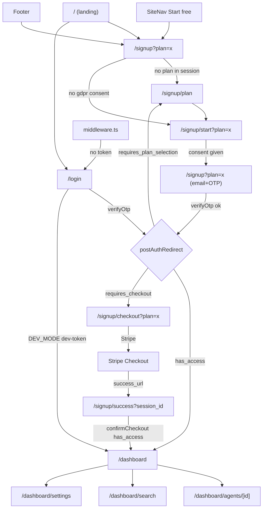
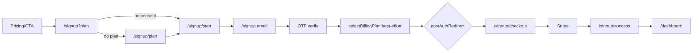
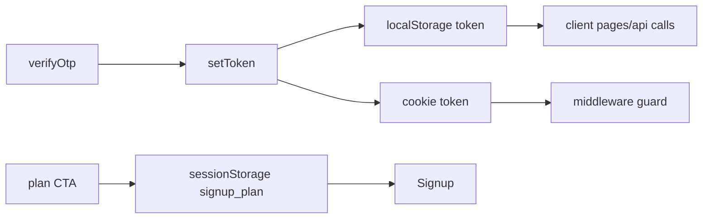

# ZizkaDB Dashboard — Knowledge Base

> Single source of truth for the Dashboard module. Reverse-engineered directly from the codebase.
>
> **Important finding:** There is **no "Pricing Modal"** in this codebase. Pricing is a static section on the landing page (`app/page.tsx`, `#pricing`). The only actual modal is the **Calendly "Book demo" modal** (`components/marketing/CalendlyBookModal.tsx`).

---

## 1. Dashboard Architecture

**Framework:** Next.js 14.2.3 App Router, React 18, TypeScript. Styling is a mix of **Tailwind** (dashboard app, `className`) and **inline styles** (marketing/landing + signup). Charts via `recharts`, icons via `lucide-react`, Stripe via `@stripe/stripe-js` + `@stripe/react-stripe-js`, JWT decode via `jose`.

**No global state library.** No Redux/Zustand/React Query/SWR/Context. State is:
- **Local** via `useState`/`useEffect` per page.
- **Cross-request "session" state** via `sessionStorage` (signup funnel) and `localStorage` + cookies (auth token).

**Rendering model:** Almost every page is a Client Component (`'use client'`). Server layer is limited to `middleware.ts` (edge auth) and static `metadata`.

**Three surfaces, gated separately:**

| Surface | Routes | Auth cookie |
|--------|--------|-------------|
| Marketing | `/`, `/docs`, `/community`, `/trust` | none |
| Signup funnel | `/signup/*`, `/login` | none (sets token on success) |
| Tenant dashboard | `/dashboard/*` | `zizkadb_token` |
| Operator admin | `/admin/*` | `zizkadb_admin_token` |

**Initialization/render flow for `/dashboard`:**

```
middleware.ts (edge) → checks zizkadb_token cookie
   ↓ (token present)
app/dashboard/layout.tsx
   → DashboardShell (sidebar/nav/signout)
       → TenantPlanBanner (fetches billing status)
       → ConnectionStatus (polls /health)
       → SubscriptionGate (billing gate) → children (page)
```

**API integration:** single module `lib/api.ts`. All calls go through `apiFetch(path, token, options)` which injects `Authorization: Bearer <token>`, `Content-Type: application/json`, and throws normalized `Error(detail)` on non-2xx. Base URL from `NEXT_PUBLIC_API_URL` (empty string → same-origin, routed by nginx to FastAPI).

**Feature flags (env):**
- `NEXT_PUBLIC_DEV_MODE === 'true'` → self-host mode: skips billing gate, shows dev-token login, changes onboarding copy.
- `NEXT_PUBLIC_API_URL` → API base (default same-origin; login dev-token defaults to `http://localhost:8000`).

**Loading/error handling:** per-page. Suspense boundaries wrap pages using `useSearchParams` (`/signup`, `/signup/start`, `/signup/checkout`, `/signup/success`, `/login`) — required by Next for CSR bailout. Errors are local component state rendered inline.

---

## 2. Folder Structure

```
dashboard/
├── middleware.ts            # Edge auth guard for /dashboard and /admin
├── app/
│   ├── layout.tsx           # Root layout + global metadata
│   ├── page.tsx             # Landing page (marketing + pricing SECTION)
│   ├── globals.css
│   ├── robots.ts, opengraph-image.tsx
│   ├── login/page.tsx       # OTP login (+ dev-token in DEV_MODE)
│   ├── signup/
│   │   ├── page.tsx         # Step 3: email + OTP (account creation)
│   │   ├── plan/page.tsx    # Step 1: plan selection (Pro/Team)
│   │   ├── start/page.tsx   # Step 2: "Before you begin" + GDPR consent
│   │   ├── checkout/page.tsx# Step 4: create Stripe session, redirect
│   │   └── success/page.tsx # Step 5: confirm checkout (poll), → dashboard
│   ├── dashboard/
│   │   ├── layout.tsx       # DashboardShell + SubscriptionGate
│   │   ├── page.tsx         # Agents home (list/create/delete)
│   │   ├── agents/[id]/page.tsx  # Agent detail (events, sessions, drift)
│   │   ├── search/page.tsx  # Semantic search
│   │   └── settings/page.tsx# API keys, embeddings, account delete, retention trial
│   ├── admin/               # Operator console (separate auth)
│   ├── community/           # Public community board
│   ├── docs/                # Docs pages
│   └── trust/page.tsx
├── components/
│   ├── DashboardShell.tsx, SubscriptionGate.tsx, TenantPlanBanner.tsx
│   ├── ConnectionStatus.tsx (+ GettingStartedChecklist)
│   ├── SiteNav.tsx, BrandLogo.tsx, AgentApiKeys.tsx, brand.ts
│   └── marketing/  (CalendlyBookModal, CompetitorCompare, etc.)
└── lib/
    ├── api.ts               # All API calls + redirect helpers
    ├── auth.ts              # token get/set/clear (localStorage + cookie)
    ├── session-cookies.ts   # cookie name constants
    ├── community.ts, demo.ts
```

---

## 3. Component Hierarchy

**Dashboard tree:**

```
DashboardLayout (app/dashboard/layout.tsx)
└── DashboardShell               # sidebar, mobile nav, sign out
    ├── BrandLogo
    ├── nav Links (Agents/Search/Settings)
    └── <main>
        ├── TenantPlanBanner     # plan pill + trial/active/past_due
        ├── ConnectionStatus     # /health poll
        └── SubscriptionGate     # billing redirect guard
            └── {page}           # DashboardPage / SearchPage / SettingsPage / AgentDetail
```

**Landing tree (`app/page.tsx`):** `SiteNav` → Hero (+`CalendlyBookModal`, `IntegrationStrip`) → `ThreeWaysConnectSection` → `ConversationCompare` → engineering cards → `TrustBar` → **Pricing section** → `CompetitorCompare` → final CTA → footer.

---

## 4. Navigation Diagram

**Routing library:** Next.js App Router (`next/navigation`: `useRouter`, `usePathname`, `useSearchParams`; `next/link`). Guarding via `middleware.ts` (matcher `/dashboard*`, `/admin*`).



**Route guards / redirects:**
- **Edge (`middleware.ts`):** `/dashboard*` without `zizkadb_token` → `/login?next=<path>` (all responses `X-Robots-Tag: noindex`). `/admin*` subpaths without `zizkadb_admin_token` → `/admin`.
- **Client (`SubscriptionGate`)**: billing-based redirect (see §6/§7).
- **Note:** middleware reads a **cookie**, but `lib/auth.ts` reads the token from **localStorage**. Both are written on `setToken()`, so they normally agree (see Risks §14).

---

## 5. Free Trial Flow (highest priority)

### Every "Start Free Trial" / signup entry point

| # | Location | File:line | Target |
|---|----------|-----------|--------|
| 1 | SiteNav "Start free →" (x2 desktop/mobile) | `SiteNav.tsx:50,60` | `/signup` |
| 2 | Landing hero "Free Trial" | `app/page.tsx:84` | `/signup` |
| 3 | Landing engineering card "Start free trial" | `app/page.tsx:155` | `/signup` |
| 4 | Landing **Pricing** Pro card | `app/page.tsx:189` | `/signup?plan=pro` |
| 5 | Landing **Pricing** Team card | `app/page.tsx:195` | `/signup?plan=team` |
| 6 | Landing Self-Hosted card "Setup guide" | `app/page.tsx:184` | `/docs` (not trial) |
| 7 | Landing final CTA "Start free trial" | `app/page.tsx:259` | `/signup` |
| 8 | Footer "Start free" | `app/page.tsx:286` | `/signup` |
| 9 | `ThreeWaysConnectSection` "Sign up" | `ThreeWaysConnectSection.tsx:135` | `/signup` |
| 10 | Login "Create one free" | `login/page.tsx:258` | `/signup` |
| 11 | Docs sections (several) | `docs/sections.tsx` | `/signup` |
| 12 | Trust page onboarding | `trust/page.tsx:386` | `/signup` |
| 13 | **Retention trial** (settings, on delete) | `settings/page.tsx:404-431` | `grantRetentionTrial` (in-place) |

There is **no shared "StartTrialButton" component** — every CTA is an inline `<Link href="/signup...">`. Plan is passed only via the `?plan=` query param, persisted to `sessionStorage.signup_plan`.

### Canonical funnel (per entry point)

```
Current Screen → Function → API → State → Navigation → Next
```

**A. From a Pricing card (`/signup?plan=pro`):**

```
Landing pricing → Link → (none) → sessionStorage.signup_plan=pro → /signup
  /signup useEffect → reads plan → stores → consent missing → /signup/start?plan=pro
  /signup/start → handleContinue → sessionStorage signup_consent_gdpr=1 (+marketing) → /signup?plan=pro
  /signup email → handleRequestOtp → requestOtp(email,'signup') → step='otp'
  /signup otp → handleVerifyOtp → verifyOtp(email,otp,{gdpr,marketing})
       → setToken(access_token) → clear consent keys
       → selectBillingPlan(token,'pro')  [best-effort]
       → clear signup_plan → router.replace(postAuthRedirect(data))
  postAuthRedirect → requires_checkout → /signup/checkout?plan=pro
  /signup/checkout → getBillingStatus → selectBillingPlan (if none) → createCheckoutSession → window.location = Stripe
  Stripe → /signup/success?session_id=... → confirmCheckout (retry x5) → has_access → /dashboard
```

**B. From a generic CTA (`/signup`, no plan):** `/signup` sees no `signup_plan` → `router.replace('/signup/plan')` → user picks plan → `/signup/start?plan=x` → back to `/signup?plan=x` → same as A.



**State initialization keys (`sessionStorage`):** `signup_plan` (`'pro'|'team'`), `signup_consent_gdpr` (`'1'`), `signup_consent_marketing` (`'1'|'0'`). All cleared after successful OTP verify.

**Analytics/events:** none found — no analytics calls in the funnel.

---

## 6. Pricing "Modal" Flow

**There is no pricing modal.** Two things could be meant:

### (a) Pricing section (`app/page.tsx:172-242`)
Static array of 3 hard-coded plans rendered as cards. **Not** fetched from `getBillingConfig()`. CTAs:
- **Self-Hosted** → `/docs` (no API, no auth) — "Setup guide".
- **Pro** → `/signup?plan=pro`.
- **Team** → `/signup?plan=team`.

Pro/Team differ only by the `?plan=` value; downstream flow is identical (only plan id and Stripe price differ server-side).

### (b) The real modal: `CalendlyBookModal` (`components/marketing/CalendlyBookModal.tsx`)
- **Owner:** `app/page.tsx` hero via `demoOpen` state (`page.tsx:34,86,91`).
- **Opens:** hero "Book demo" button `onClick={() => setDemoOpen(true)}`.
- **Props:** `{ open, onClose }`.
- **Internal state:** `booked`, `loadErr`; refs for embed.
- **Behavior:** lazy-loads Calendly script, mounts inline widget, listens for `postMessage` `calendly.event_scheduled` (validates `origin === https://calendly.com`) → shows "You're booked". ESC closes when not booked.
- **No app API calls** (external Calendly only).

There is a **separate** lead-capture path (`lib/demo.ts` → `submitDemoRequest` → `POST /v1/demo-requests`) but it is not wired into the Calendly modal in the files reviewed.

---

## 7. Business Logic / Rules

**Auth model:** passwordless email OTP for managed cloud; `POST /v1/auth/request-otp` then `/verify-otp` returns a JWT (`access_token`, 7-day TTL per `TOKEN_MAX_AGE_SEC`). Self-host DEV_MODE offers `POST /v1/auth/dev-token`.

**Signup vs login:** `requestOtp(email, intent)` — signup passes `intent='signup'`; if backend says "already registered", signup surfaces a "Sign in →" link (`signup/page.tsx:72-73`).

**Billing gate (managed cloud only)** — central logic in `lib/api.ts`:
- `postAuthRedirect(data)` (`api.ts:358`): `has_access`→`/dashboard`; `requires_plan_selection`→`/signup/plan`; `requires_checkout`→`/signup/checkout?plan=<plan>` (or `/signup/plan` if plan unknown); default `/dashboard`.
- `billingGateRedirect(status)` (`api.ts:373`): returns `null` if `!enforced` or `has_access`; else routes to plan/checkout; final fallback `/signup/plan`.
- `SubscriptionGate` runs `billingGateRedirect` on every dashboard mount; **skipped entirely when `IS_DEV_MODE`**.

**Trial rules:** 30-day free trial (`trial_days` from `getBillingConfig`, shown in `TenantPlanBanner` as "Free trial until <date>" when `subscription_status==='trialing'`). Card is collected at Stripe checkout. **Copy inconsistency:** landing pricing says "card required"; `/signup/plan` and `/signup` say "No credit card required" (see Risks).

**Retention trial:** managed-cloud users get a one-time "X more days free" offer in the delete-account modal (`grantRetentionTrial` → `/v1/account/retention-trial`), gated by `accountOpts.retention_trial_available`.

**Plan selection persistence:** `selectBillingPlan` called twice in the happy path — best-effort after OTP (`signup/page.tsx:99`) and again in checkout if `!status.plan` (`checkout/page.tsx:83`).

**Feature gating:** Self-host (`DEV_MODE`) bypasses billing; pricing is UI-only (plans not enforced client-side beyond gate redirects).

---

## 8. API Layer

All in `lib/api.ts` via `apiFetch` (except unauthenticated `fetch` calls for OTP/billing-config/dev-token/demo-requests). **No caching, no retry** except `/signup/success` (manual 5-attempt poll). **No React Query/SWR.**

**Endpoints by area:**
- **Auth:** `requestOtp`, `verifyOtp`, dev-token (login page).
- **Billing:** `getBillingConfig` (public), `getBillingStatus`, `selectBillingPlan`, `createCheckoutSession`, `confirmCheckout`.
- **Account:** `getAccountOptions`, `grantRetentionTrial`, `deleteManagedAccount`.
- **Agents/events:** `getAgents`, `createAgent`, `deleteAgent`, `get/create/revokeAgentApiKey`, `sendTestEvent`, `sendAgentTestEvent`, `getAgentStats`, `getEvents`, `getWhyChain`, `searchEvents`, `getAgentSessions`, `getMemoryDiff`, `timeTravel`, `getAgentBaseline`.
- **Settings:** embeddings catalog/get/update; tenant API keys.
- **Admin:** OTP + overview/telemetry/managed/demo endpoints.

**Error handling:** `formatApiError` flattens string / array / `{msg}` FastAPI detail shapes. `DashboardPage` special-cases `401`/"invalid token" → redirect to `/login` (`dashboard/page.tsx:54`).

**Polling:** Agents list every 10s (`dashboard/page.tsx:66`); `/health` every 30s (`ConnectionStatus.tsx:25`); billing status refetched by `TenantPlanBanner` and `SubscriptionGate` on mount.

---

## 9. State Management

- **Auth token:** `localStorage['zizkadb_token']` + a mirrored cookie (`lib/auth.ts`). Cookie is what middleware reads; localStorage is what client code reads.
- **Signup funnel:** `sessionStorage` (`signup_plan`, `signup_consent_gdpr`, `signup_consent_marketing`).
- **Per-page UI:** `useState` + `useEffect`. Cleanup uses a `cancelled` flag pattern to avoid setState-after-unmount (`SubscriptionGate`, `checkout`, `success`, `dashboard`).
- **No derived global store, no memoization utilities, no context providers.**



---

## 10. User Journey (end-to-end, with variations)

**Managed cloud, new Pro user (happy path):**
Landing → (Pricing: Pro) → `/signup?plan=pro` → `/signup/start` (consent) → `/signup` (email → OTP) → account created + plan selected → `/signup/checkout?plan=pro` → Stripe → `/signup/success` → **/dashboard** → empty state `GettingStartedChecklist` → create agent (key shown once) → agent appears (10s poll).

**Variations:**
- **Generic CTA (no plan):** inserts `/signup/plan` first.
- **Existing account tries signup:** "already registered" → link to `/login`.
- **Returning login:** `/login` → OTP → `postAuthRedirect` (may bounce to plan/checkout if billing incomplete).
- **Self-host (DEV_MODE):** `/login` → "Open my dashboard" (dev-token) → `/dashboard` (no billing gate).
- **Trial expiry / past_due:** `TenantPlanBanner` shows "Payment failed"; gate may push to checkout.
- **Account deletion:** Settings → delete modal → optional retention trial → confirm "DELETE" → `/login?deleted=1`.

---

## 11. Edge Cases (found in code)

- **Missing plan param:** every funnel page falls back to `/signup/plan`.
- **Missing consent:** `/signup` bounces to `/signup/start`.
- **Missing `session_id` on success:** shows "Missing checkout session" (`success/page.tsx:44`).
- **Slow Stripe confirmation:** success page polls up to 5× with 1.5–2s backoff; distinguishes `pending_checkout`/`incomplete` states (`success/page.tsx:51-114`).
- **401 / invalid token:** Agents page redirects to `/login`; `requireAuth()` hard-redirects via `window.location`.
- **API unreachable:** `ConnectionStatus` red dot + setup hint; dev-login shows docker hint.
- **Browser refresh mid-funnel:** state survives via `sessionStorage`; token via `localStorage`+cookie.
- **Multiple clicks / races:** async effects guarded by `cancelled` flags; buttons disabled while `loading`/`creating`/`busy`.
- **Empty states:** agents → `GettingStartedChecklist`; no API keys → prompt to create agent.
- **Direct URL access:** `/dashboard*` guarded at edge; `/signup/checkout` & `/success` re-check token client-side and redirect to `/signup`.
- **`getEvents` response shape:** handles both array and `{events:[]}` (`api.ts:91`).

---

## 12. Technical Notes

- Suspense wrappers are mandatory around `useSearchParams` pages (Next 14 CSR bailout).
- `middleware` adds `noindex` to all dashboard/admin responses; `dashboard/layout` also sets `robots:false` metadata.
- `postAuthRedirect` and `billingGateRedirect` are the two single-source-of-truth routing helpers — reuse them for any new gated flow.
- Styling is inconsistent: dashboard uses Tailwind; marketing/signup use inline styles + a raw `<style>` block for responsive breakpoints (`page.tsx:44-63`).
- Plans are duplicated: landing (`page.tsx`), `/signup/plan` (`PLANS`), and backend `getBillingConfig` all define plan data independently.

---

## 13. Areas for Improvement (documented, not changed)

1. **Duplicate plan definitions** (landing, `/signup/plan`, backend `getBillingConfig`) → drift risk; consolidate on `getBillingConfig`.
2. **No shared trial-CTA component** — 13 inline links; a `<StartTrialButton plan?>` would centralize analytics + copy.
3. **Repeated funnel-guard logic** (`sessionStorage` plan/consent checks re-implemented in `/signup`, `/signup/start`, `/signup/checkout`) → extract a hook (`useSignupFunnelGuard`).
4. **Duplicated OTP form** (`login` vs `signup` are ~90% identical) → shared `<OtpForm/>`.
5. **No analytics/telemetry** on funnel steps → hard to measure drop-off.
6. **No React Query/SWR** → manual polling + no dedupe/caching; billing status fetched 2–3× per dashboard load (`SubscriptionGate` + `TenantPlanBanner`).
7. **Inconsistent styling systems** (Tailwind vs inline).

---

## 14. Potential Risks

1. **Copy contradiction on credit card:** `/signup/plan` and `/signup` say "No credit card required," but the flow forces Stripe checkout and landing says "card required." User-trust/legal risk. (`plan/page.tsx:57`, `signup/page.tsx:180` vs `page.tsx:190,196`.)
2. **Token in `localStorage`** is XSS-exposed; the mirrored non-`HttpOnly` cookie is also JS-readable. Middleware trusts the cookie only.
3. **Auth source mismatch:** middleware reads cookie, app reads localStorage. If one is cleared (e.g., cookie expiry vs localStorage), user can pass the edge guard but fail client calls, or vice-versa.
4. **`selectBillingPlan` best-effort swallow** (`signup/page.tsx:99` `catch {}`) — a failure here silently defers plan to checkout; acceptable but undocumented.
5. **Retention-trial / delete** are destructive and rely on client `accountOpts.managed_cloud`; ensure backend re-validates.
6. **Calendly `postMessage`**: origin is validated (good), but booked-state cannot be forged into app state beyond a UI success screen (low risk).
7. **No client-side rate-limit/backoff on OTP request** (relies on backend).

---

## Reference: Key Files

| Concern | File |
|---------|------|
| Edge auth guard | `middleware.ts` |
| API + redirect helpers | `lib/api.ts` |
| Token storage | `lib/auth.ts`, `lib/session-cookies.ts` |
| Landing + pricing section | `app/page.tsx` |
| Signup funnel | `app/signup/{plan,start,page,checkout,success}` |
| Login | `app/login/page.tsx` |
| Dashboard shell/gate | `components/{DashboardShell,SubscriptionGate,TenantPlanBanner}.tsx` |
| Agents home | `app/dashboard/page.tsx` |
| Settings (keys/embeddings/account) | `app/dashboard/settings/page.tsx` |
| Book-demo modal | `components/marketing/CalendlyBookModal.tsx` |
