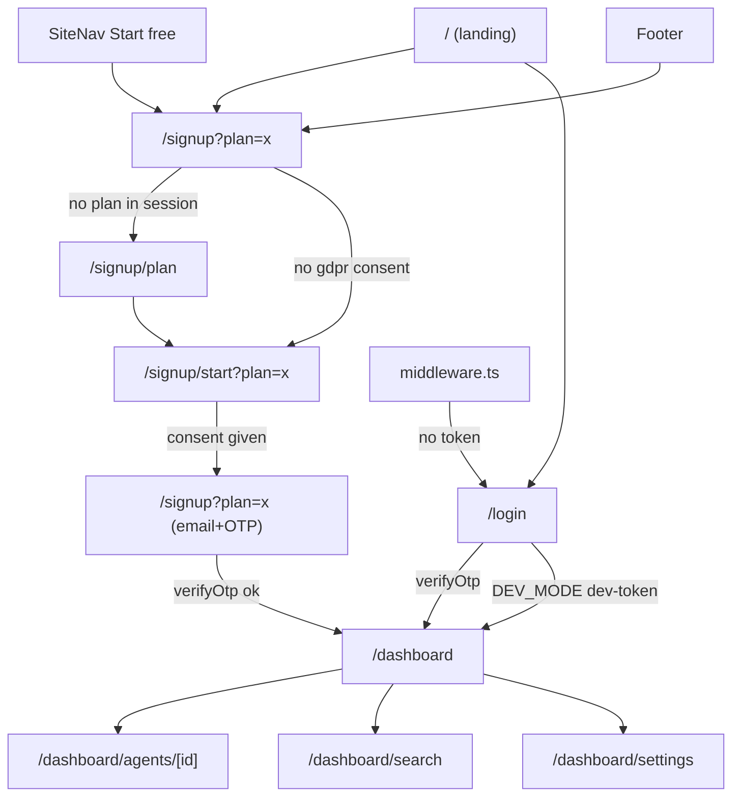
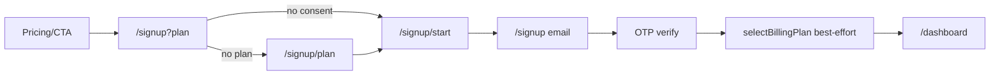
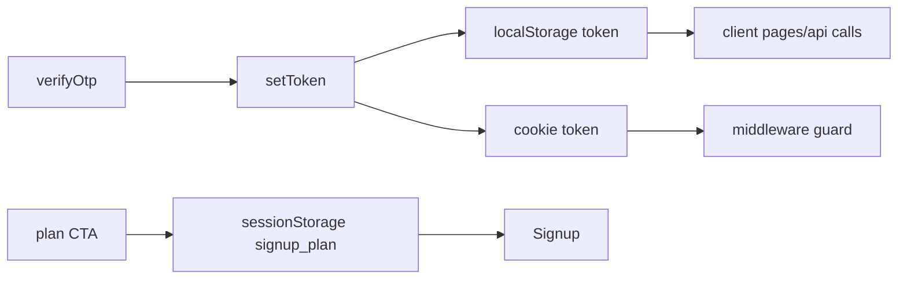
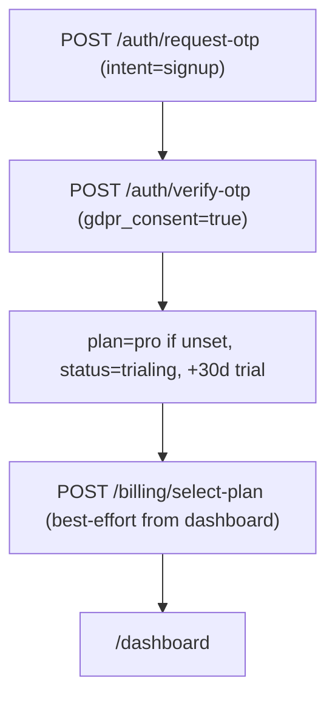
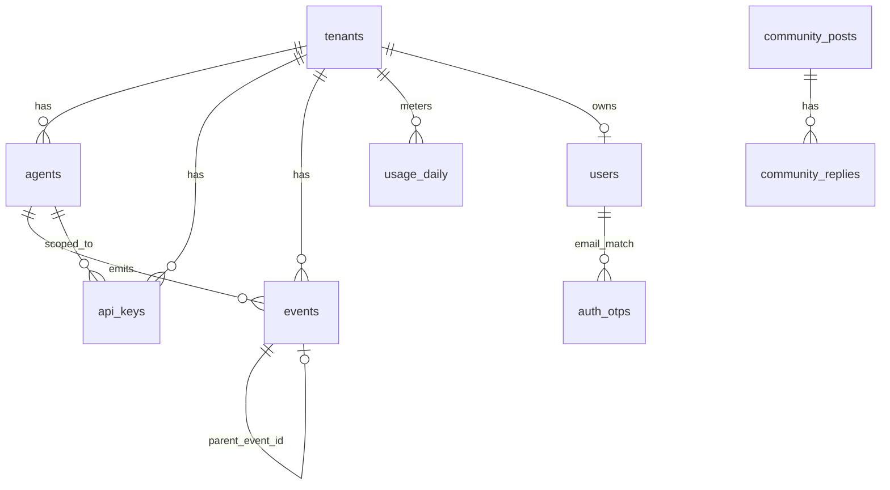

# ZizkaDB Dashboard — Knowledge Base

> Single source of truth for the Dashboard module. Reverse-engineered directly from the codebase.
>
> **Last verified:** 2026-07-02 · **No payment provider:** signup is plan → consent → OTP → `/dashboard` with a 30-day trial. Legacy `/signup/checkout` redirects to `/signup/plan`; `/signup/success` redirects to `/dashboard`. API key limits: Self-Hosted 1 / Pro 3 / Team 10 / Enterprise 50 (enforcement via `API_KEY_LIMITS_ENFORCED`, default OFF; self-hosted resolved via `DEPLOYMENT_MODE`, not `users.plan`).
>
> **Important finding:** There is **no "Pricing Modal"** in this codebase. Pricing is a static section on the landing page (`app/page.tsx`, `#pricing`). The only actual modal is the **Calendly "Book demo" modal** (`components/marketing/CalendlyBookModal.tsx`).
>
> **Scope:** covers the entire `dashboard/` Next.js app — tenant product (`/dashboard/*`), signup funnel, login, marketing/community/docs/trust, and the operator admin console — plus the backend touch points it depends on (`core/`). SDKs (`sdk/*`), MCP (`mcp/`), and integrations (`integrations/*`) are the event *producers*; they are pointers only here (see §17.4), not fully documented.

## Table of Contents

1. [Dashboard Architecture](#1-dashboard-architecture)
2. [Folder Structure](#2-folder-structure)
3. [Component Hierarchy](#3-component-hierarchy)
4. [Navigation Diagram](#4-navigation-diagram)
5. [Free Trial Flow](#5-free-trial-flow-highest-priority)
6. [Pricing "Modal" Flow](#6-pricing-modal-flow)
7. [Business Logic / Rules](#7-business-logic--rules)
8. [API Layer](#8-api-layer)
9. [State Management](#9-state-management)
10. [User Journey](#10-user-journey-end-to-end-with-variations)
11. [Edge Cases](#11-edge-cases-found-in-code)
12. [Technical Notes](#12-technical-notes) · [12.5 Coding Conventions](#125-coding-conventions--practices)
13. [Areas for Improvement](#13-areas-for-improvement-documented-not-changed)
14. [Potential Risks](#14-potential-risks)
15. [Local Development, Build & Environment](#15-local-development-build--environment)
16. [Admin Surface, Component Catalog & Key Types](#16-admin-surface-component-catalog--key-types)
17. [Full-Stack Touch Points](#17-full-stack-touch-points-dashboard--backend--ecosystem)
18. [Backend Business Logic & State Machines](#18-backend-business-logic--state-machines)
19. [Per-Screen Functional Reference](#19-per-screen-functional-reference)
20. [Marketing, Public & Admin Surfaces](#20-marketing-public--admin-surfaces)
21. [Data Model (backend)](#21-data-model-backend)
22. [Glossary](#22-glossary)
- [Reference: Key Files](#reference-key-files)

---

## 1. Dashboard Architecture

**Framework:** Next.js 14.2.3 App Router, React 18, TypeScript. Styling is a mix of **Tailwind** (dashboard app, `className`) and **inline styles** (marketing/landing + signup). Charts via `recharts`, icons via `lucide-react`, JWT decode via `jose`.

**No global state library.** No Redux/Zustand/React Query/SWR/Context. State is:
- **Local** via `useState`/`useEffect` per page.
- **Cross-request "session" state** via `sessionStorage` (signup funnel) and `localStorage` + cookies (auth token).

**Rendering model:** Almost every page is a Client Component (`'use client'`). Server layer is limited to `middleware.ts` (edge auth) and static `metadata`.

**Three surfaces, gated separately:**

| Surface | Routes | Auth cookie |
|--------|--------|-------------|
| Marketing | `/`, `/docs`, `/community`, `/trust` | none |
| Signup funnel | `/signup/*`, `/login` | none (sets token on success) |
| Tenant dashboard | `/dashboard/*` | `zizkadb_token` |
| Operator admin | `/admin/*` | `zizkadb_admin_token` |

**Initialization/render flow for `/dashboard`:**

```
middleware.ts (edge) → checks zizkadb_token cookie
   ↓ (token present)
app/dashboard/layout.tsx
   → DashboardShell (sidebar/nav/signout)
       → TenantPlanBanner (fetches billing status — informational)
       → ConnectionStatus (polls /health)
       → children (page)
```

**API integration:** single module `lib/api.ts`. All calls go through `apiFetch(path, token, options)` which injects `Authorization: Bearer <token>`, `Content-Type: application/json`, and throws normalized `Error(detail)` on non-2xx. Base URL from `NEXT_PUBLIC_API_URL` (empty string → same-origin, routed by nginx to FastAPI).

**Feature flags (env):**
- `NEXT_PUBLIC_DEV_MODE === 'true'` → self-host mode: enables dev-token login, changes onboarding copy.
- `NEXT_PUBLIC_API_URL` → API base (default same-origin; login dev-token defaults to `http://localhost:8000`).

**Loading/error handling:** per-page. Suspense boundaries wrap pages using `useSearchParams` (`/signup`, `/signup/start`, `/signup/checkout`, `/signup/success`, `/login`) — required by Next for CSR bailout. Errors are local component state rendered inline.

---

## 2. Folder Structure

```
dashboard/
├── middleware.ts            # Edge auth guard for /dashboard and /admin
├── app/
│   ├── layout.tsx           # Root layout + global metadata
│   ├── page.tsx             # Landing page (marketing + pricing SECTION)
│   ├── globals.css
│   ├── robots.ts, opengraph-image.tsx
│   ├── login/page.tsx       # OTP login (+ dev-token in DEV_MODE)
│   ├── signup/
│   │   ├── page.tsx         # Step 3: email + OTP (account creation)
│   │   ├── plan/page.tsx    # Step 1: plan selection (Pro/Team)
│   │   ├── start/page.tsx   # Step 2: "Before you begin" + GDPR consent
│   │   ├── checkout/page.tsx# Legacy redirect → /signup/plan
│   │   └── success/page.tsx # Legacy redirect → /dashboard
│   ├── dashboard/
│   │   ├── layout.tsx       # DashboardShell only (no billing gate)
│   │   ├── page.tsx         # Agents home (list/create/delete)
│   │   ├── agents/[id]/page.tsx  # Agent detail (events, sessions, drift)
│   │   ├── search/page.tsx  # Semantic search
│   │   └── settings/page.tsx# API keys, embeddings, account delete, retention trial
│   ├── admin/               # Operator console (separate auth)
│   ├── community/           # Public community board
│   ├── docs/                # Docs pages
│   └── trust/page.tsx
├── components/
│   ├── DashboardShell.tsx, TenantPlanBanner.tsx, ApiKeyUsage.tsx
│   ├── hooks/useApiKeyQuota.ts
│   ├── ConnectionStatus.tsx (+ GettingStartedChecklist)
│   ├── SiteNav.tsx, BrandLogo.tsx, AgentApiKeys.tsx, brand.ts
│   └── marketing/  (CalendlyBookModal, CompetitorCompare, etc.)
└── lib/
    ├── api.ts               # All API calls + redirect helpers
    ├── auth.ts              # token get/set/clear (localStorage + cookie)
    ├── session-cookies.ts   # cookie name constants
    ├── community.ts, demo.ts
```

---

## 3. Component Hierarchy

**Dashboard tree:**

```
DashboardLayout (app/dashboard/layout.tsx)
└── DashboardShell               # sidebar, mobile nav, sign out
    ├── BrandLogo
    ├── nav Links (Agents/Search/Settings)
    └── <main>
        └── {page}           # DashboardPage / SearchPage / SettingsPage / AgentDetail
```

**Landing tree (`app/page.tsx`):** `SiteNav` → Hero (+`CalendlyBookModal`, `IntegrationStrip`) → `ThreeWaysConnectSection` → `ConversationCompare` → engineering cards → `TrustBar` → **Pricing section** → `CompetitorCompare` → final CTA → footer.

---

## 4. Navigation Diagram

**Routing library:** Next.js App Router (`next/navigation`: `useRouter`, `usePathname`, `useSearchParams`; `next/link`). Guarding via `middleware.ts` (matcher `/dashboard*`, `/admin*`).



**Route guards / redirects:**
- **Edge (`middleware.ts`):** `/dashboard*` without `zizkadb_token` → `/login?next=<path>` (all responses `X-Robots-Tag: noindex`). `/admin*` subpaths without `zizkadb_admin_token` → `/admin`.
- **Note:** middleware reads a **cookie**, but `lib/auth.ts` reads the token from **localStorage**. Both are written on `setToken()`, so they normally agree (see Risks §14).

---

## 5. Free Trial Flow (highest priority)

### Every "Start Free Trial" / signup entry point

| # | Location | File:line | Target |
|---|----------|-----------|--------|
| 1 | SiteNav "Start free →" (x2 desktop/mobile) | `SiteNav.tsx:50,60` | `/signup` |
| 2 | Landing hero "Free Trial" | `app/page.tsx:84` | `/signup` |
| 3 | Landing engineering card "Start free trial" | `app/page.tsx:155` | `/signup` |
| 4 | Landing **Pricing** Pro card | `app/page.tsx:189` | `/signup?plan=pro` |
| 5 | Landing **Pricing** Team card | `app/page.tsx:195` | `/signup?plan=team` |
| 6 | Landing Self-Hosted card "Setup guide" | `pricing-plans.ts` / `PricingCard` | `/docs` (not trial) |
| 7 | Landing **Pricing** Enterprise card | `pricing-plans.ts` / `PricingCard` | `/enterprise#contact` |
| 8 | Landing final CTA "Start free trial" | `app/page.tsx:259` | `/signup` |
| 9 | Footer "Start free" | `app/page.tsx:286` | `/signup` |
| 10 | `ThreeWaysConnectSection` "Sign up" | `ThreeWaysConnectSection.tsx:135` | `/signup` |
| 11 | Login "Create one free" | `login/page.tsx:258` | `/signup` |
| 12 | Docs sections (several) | `docs/sections.tsx` | `/signup` |
| 13 | Trust page onboarding | `trust/page.tsx:386` | `/signup` |
| 14 | **Retention trial** (settings, on delete) | `settings/page.tsx:404-431` | `grantRetentionTrial` (in-place) |

There is **no shared "StartTrialButton" component** — every CTA is an inline `<Link href="/signup...">`. Plan is passed only via the `?plan=` query param, persisted to `sessionStorage.signup_plan`.

### Canonical funnel (per entry point)

```
Current Screen → Function → API → State → Navigation → Next
```

**A. From a Pricing card (`/signup?plan=pro`):**

```
Landing pricing → Link → (none) → sessionStorage.signup_plan=pro → /signup
  /signup useEffect → reads plan → stores → consent missing → /signup/start?plan=pro
  /signup/start → handleContinue → sessionStorage signup_consent_gdpr=1 (+marketing) → /signup?plan=pro
  /signup email → handleRequestOtp → requestOtp(email,'signup') → step='otp'
  /signup otp → handleVerifyOtp → verifyOtp(email,otp,{gdpr,marketing})
       → setToken(access_token) → clear consent keys
       → selectBillingPlan(token,'pro')  [best-effort]
       → clear signup_plan → router.replace('/dashboard')
  Backend sets subscription_status=trialing, trial_ends_at=+30d on OTP verify
```

**B. From a generic CTA (`/signup`, no plan):** `/signup` sees no `signup_plan` → `router.replace('/signup/plan')` → user picks plan → `/signup/start?plan=x` → back to `/signup?plan=x` → same as A.



**State initialization keys (`sessionStorage`):** `signup_plan` (`'pro'|'team'`), `signup_consent_gdpr` (`'1'`), `signup_consent_marketing` (`'1'|'0'`). All cleared after successful OTP verify.

**Analytics/events:** none found — no analytics calls in the funnel.

---

## 6. Pricing "Modal" Flow

**There is no pricing modal.** Two things could be meant:

### (a) Pricing section (`app/page.tsx:172-242`)
Static array of 3 hard-coded plans rendered as cards. **Not** fetched from the backend. CTAs:
- **Self-Hosted** → `/docs` (no API, no auth) — "Setup guide".
- **Pro** → `/signup?plan=pro`.
- **Team** → `/signup?plan=team`.

Pro/Team differ only by the `?plan=` value; downstream flow is identical (plan id is persisted via `selectBillingPlan` and shown in `TenantPlanBanner`).

### (b) The real modal: `CalendlyBookModal` (`components/marketing/CalendlyBookModal.tsx`)
- **Owner:** `app/page.tsx` hero via `demoOpen` state (`page.tsx:34,86,91`).
- **Opens:** hero "Book demo" button `onClick={() => setDemoOpen(true)}`.
- **Props:** `{ open, onClose }`.
- **Internal state:** `booked`, `loadErr`; refs for embed.
- **Behavior:** lazy-loads Calendly script, mounts inline widget, listens for `postMessage` `calendly.event_scheduled` (validates `origin === https://calendly.com`) → shows "You're booked". ESC closes when not booked.
- **No app API calls** (external Calendly only).

There is a **separate** lead-capture path (`lib/demo.ts` → `submitDemoRequest` → `POST /v1/demo-requests`) but it is not wired into the Calendly modal in the files reviewed.

---

## 7. Business Logic / Rules

**Auth model:** passwordless email OTP for managed cloud; `POST /v1/auth/request-otp` then `/verify-otp` returns a JWT (`access_token`, 7-day TTL per `TOKEN_MAX_AGE_SEC`). Self-host DEV_MODE offers `POST /v1/auth/dev-token`.

**Signup vs login:** Both flows use `intent` on `requestOtp` / `verifyOtp` (`login` | `signup`, default `login`). Login request-otp returns **404** when no account exists; signup returns **409** when the email is already registered. Login verify only succeeds for existing users; signup requires `gdpr_consent=true` and creates a new tenant/user. OTP is consumed atomically inside the verify transaction (invalid OTP or pre-check failures do not burn the code). After success, auth uses `window.location.assign` (hard redirect) to avoid stuck OTP screens. Helpers: `lib/auth-errors.ts`, `lib/signup-funnel.ts`, `hooks/useResendCooldown.ts` (60s resend cooldown on login and signup).

**Billing / trial (no payment provider):** signup OTP verify sets `plan=pro` (if unset), `subscription_status=trialing`, `trial_ends_at=+30d` (also converts legacy `pending_checkout` rows). `postAuthRedirect()` always returns `/dashboard`. `getBillingStatus` / `billing_status_payload` always return `has_access: true`, `enforced: false`, `requires_checkout: false` — informational only for `TenantPlanBanner`.

**Trial rules:** 30-day free trial (`trial_days` from billing status, shown in `TenantPlanBanner` as "Free trial until <date>" when `subscription_status==='trialing'`). No credit card or checkout step. Landing pricing copy may still mention card for future billing — funnel copy says "No credit card required."

**Auth gate vs subscription:** `get_tenant` (`core/api/deps.py`) validates the token but does **not** check subscription status. There is no client-side billing gate (`SubscriptionGate` removed). Account routes and API key **creation** are JWT-only via `require_dashboard_session`.

**Retention trial:** managed-cloud users get a one-time "X more days free" offer in the delete-account modal (`grantRetentionTrial` → `/v1/account/retention-trial`), gated by `accountOpts.retention_trial_available`.

**Plan selection persistence:** `selectBillingPlan` called best-effort after OTP (`signup/page.tsx`) to persist the plan chosen in the funnel.

**Feature gating:** Self-host (`DEV_MODE`) enables dev-token login and changes onboarding copy; billing is not enforced anywhere.

**API key plan limits:** the number of **active** (`revoked = FALSE`) API keys per tenant is capped by plan — Self-Hosted 1, Pro 3, Team 10, Enterprise 50; every other case (no/unknown plan) is **unlimited** when enforcement is off. The limit counts **all** keys (tenant-wide + agent-scoped), and because creating an agent auto-creates a key (`create_agent`), each agent consumes one slot on capped plans.
- **Single source of truth:** `core/services/entitlements.py` (`PLAN_ENTITLEMENTS`, `entitlements_for_plan(plan)`/`api_key_limit_for_plan(plan)`). Generalized beyond just API keys — adding a new capped resource (e.g. max agents) is a one-field change to `PlanEntitlements` plus a value per plan; adding a plan is a one-line dict entry.
- **No-deploy override:** set `API_KEY_LIMIT_<PLAN>` (e.g. `API_KEY_LIMIT_PRO=5`) and restart to change one plan's limit without touching code. Falls back to the `PLAN_ENTITLEMENTS` default when unset/blank/non-integer. `billing.py`'s `PLAN_CATALOG` copy ("N active API keys") is computed from this same source, so it can't drift from what's enforced.
- **Enforcement (backend, real guard):** `assert_and_reserve_api_key_slot` in `core/services/api_keys.py` runs inside a per-tenant advisory-locked transaction (race-safe) before every insert; wired into `create_api_key`, `create_agent_api_key`, and `create_agent`. Resolves the plan via `services.billing.fetch_effective_plan` (not `fetch_tenant_plan` directly — see below). Fail-open on plan-lookup error. Behind kill switch `API_KEY_LIMITS_ENFORCED` (defaults OFF; ships dormant for staged rollout).
- **Self-hosted plan resolution:** self-host installs never set `users.plan`, and the startup NULL→`'pro'` backfill in `core/db/connection.py` would otherwise silently apply the Pro limit. `fetch_effective_plan(executor, tenant_id)` (`core/services/billing.py`) checks `is_self_hosted_deployment()` (env var `DEPLOYMENT_MODE=self_hosted`, set by self-host Docker/native configs) first and short-circuits to plan `"self_hosted"` before ever reading `users.plan`. Managed cloud never sets `DEPLOYMENT_MODE`, so its behavior is unchanged.
- **Creation is JWT-only:** all three creation routes use `require_dashboard_session` (a scoped API key can no longer mint keys). List/revoke unchanged.
- **Usage:** `GET /v1/auth/api-keys/usage` → `{plan, limit, used, unlimited, at_limit}` (unlimited whenever enforcement is off / uncapped). Frontend hook `useApiKeyQuota` + `ApiKeyUsage` component; the UI reads limits from this endpoint (never hardcodes them) and disables create + the key-name input at the limit. Deleting a key **or an agent** (cascade via `fk_api_keys_agent ON DELETE CASCADE`) frees a slot immediately (live `COUNT(*)`, no caching).
- **Error shape:** limit breach returns `409` with `detail={msg, code:"api_key_limit_reached", plan, limit, used}` (the `msg` key renders through `formatApiError`).
- **Enterprise/self-hosted plan assignment:** `enterprise` is sales-assigned (manual `users.plan` update by an operator, matching the existing `/enterprise#contact` lead-capture flow — no self-serve signup); `self_hosted` is automatic via `DEPLOYMENT_MODE`. Neither goes through `select_plan`/`VALID_PLANS` (still `{"pro", "team"}`, self-serve only).
- **Out of scope (by design):** `subscription_status` (`trialing|active|past_due|canceled`) is not factored into entitlement decisions — no feature in this codebase gates on it today (`billing_status_payload` always returns `has_access: true`). A `past_due`/`canceled` user keeps their plan's key limit until real billing enforcement exists.

---

## 8. API Layer

All in `lib/api.ts` via `apiFetch` (except unauthenticated `fetch` calls for OTP/dev-token/demo-requests). **No caching, no retry.** **No React Query/SWR.**

**Endpoints by area:**
- **Auth:** `requestOtp`, `verifyOtp`, dev-token (login page), `getApiKeys`, `getApiKeyUsage`, `createApiKey`, `revokeApiKey`.
- **Billing:** `getBillingStatus`, `selectBillingPlan` (informational / plan persistence only).
- **Account:** `getAccountOptions`, `grantRetentionTrial`, `deleteManagedAccount`.
- **Agents/events:** `getAgents`, `createAgent`, `deleteAgent`, `get/create/revokeAgentApiKey`, `sendTestEvent`, `sendAgentTestEvent`, `getAgentStats`, `getEvents`, `getWhyChain`, `searchEvents`, `getAgentSessions`, `getMemoryDiff`, `timeTravel`, `getAgentBaseline`.
- **Settings:** embeddings catalog/get/update; tenant API keys.
- **Admin:** OTP + overview/telemetry/managed/demo endpoints.

**Error handling:** `formatApiError` flattens string / array / `{msg}` FastAPI detail shapes. `DashboardPage` special-cases `401`/"invalid token" → redirect to `/login` (`dashboard/page.tsx:54`).

**Polling:** Agents list every 10s (`dashboard/page.tsx:66`); `/health` every 30s (`ConnectionStatus.tsx:25`); billing status fetched once by `TenantPlanBanner` on mount; `useApiKeyQuota` refreshes on window focus.

---

## 9. State Management

- **Auth token:** `localStorage['zizkadb_token']` + a mirrored cookie (`lib/auth.ts`). Cookie is what middleware reads; localStorage is what client code reads.
- **Signup funnel:** `sessionStorage` (`signup_plan`, `signup_consent_gdpr`, `signup_consent_marketing`).
- **Per-page UI:** `useState` + `useEffect`. Cleanup uses a `cancelled` flag pattern to avoid setState-after-unmount (`signup`, `dashboard`, `TenantPlanBanner`).
- **No derived global store, no memoization utilities, no context providers.**



---

## 10. User Journey (end-to-end, with variations)

**Managed cloud, new Pro user (happy path):**
Landing → (Pricing: Pro) → `/signup?plan=pro` → `/signup/start` (consent) → `/signup` (email → OTP) → account created + plan selected → **/dashboard** → empty state `GettingStartedChecklist` → create agent (key shown once) → agent appears (10s poll).

**Variations:**
- **Generic CTA (no plan):** inserts `/signup/plan` first.
- **Existing account tries signup:** request-otp **409** → "Sign in →" link with `?email=` prefill.
- **Deleted account re-register:** after delete, `/login?deleted=1` banner → `/signup/plan`; signup path sends `intent=signup` + GDPR consent (not login verify).
- **Login with unknown email:** request-otp **404** → "Create account" CTA to `/signup/plan`.
- **Returning login:** `/login` → OTP (auto-submit at 6 digits, resend cooldown) → hard redirect `/dashboard`.
- **Self-host (DEV_MODE):** `/login` → "Open my dashboard" (dev-token) → `/dashboard`.
- **Trial expiry / past_due:** `TenantPlanBanner` shows plan + trial end; no checkout redirect (billing not enforced).
- **Account deletion:** Settings → delete modal → optional retention trial → confirm "DELETE" → `clearSignupSession()` → `/login?deleted=1`.
- **Legacy URLs:** `/signup/checkout` → `/signup/plan`; `/signup/success` → `/dashboard`.

---

## 11. Edge Cases (found in code)

- **Missing plan param:** every funnel page falls back to `/signup/plan`.
- **Missing consent:** `/signup` bounces to `/signup/start`.
- **Legacy checkout/success URLs:** immediately redirect client-side (`checkout` → plan, `success` → dashboard).
- **401 / invalid token:** Agents page redirects to `/login`; `requireAuth()` hard-redirects via `window.location`.
- **API unreachable:** `ConnectionStatus` red dot + setup hint; dev-login shows docker hint.
- **Browser refresh mid-funnel:** state survives via `sessionStorage`; token via `localStorage`+cookie.
- **Multiple clicks / races:** async effects guarded by `cancelled` flags; buttons disabled while `loading`/`creating`/`busy`.
- **Empty states:** agents → `GettingStartedChecklist`; no API keys → prompt to create agent.
- **Direct URL access:** `/dashboard*` guarded at edge; legacy `/signup/checkout` & `/success` redirect away.
- **`getEvents` response shape:** handles both array and `{events:[]}` (`api.ts:91`).
- **Signup screen flicker (fixed):** `/signup` gates its email/OTP form behind a `checked` state so it no longer flashes before a redirect to `/signup/plan` or `/signup/start` resolves.
- **Signup funnel keys:** centralized in `lib/signup-funnel.ts` (`SIGNUP_PLAN_KEY`, consent keys, `clearSignupSession()`).

---

## 12. Technical Notes

- Suspense wrappers are mandatory around `useSearchParams` pages (Next 14 CSR bailout).
- `middleware` adds `noindex` to all dashboard/admin responses; `dashboard/layout` also sets `robots:false` metadata.
- `postAuthRedirect` always returns `/dashboard` — reuse it after OTP verify for consistency.
- Styling is inconsistent: dashboard uses Tailwind; marketing/signup use inline styles + a raw `<style>` block for responsive breakpoints (`page.tsx:44-63`).
- Plans are duplicated: landing (`page.tsx`), `/signup/plan` (`PLANS`), and backend `PLAN_CATALOG` in `billing.py` all define plan data independently.

---

## 12.5 Coding Conventions & Practices

- **TypeScript:** `strict: true`, `isolatedModules`, `skipLibCheck`, `noEmit` (`tsconfig.json`). Import via the `@/*` alias (root-relative). Prefer explicit return types on `lib/` functions; `apiFetch` currently returns untyped JSON — annotate new endpoints.
- **Linting/formatting:** ESLint `next` + `next/core-web-vitals` only (`package.json`). **No Prettier** — match surrounding style manually (2-space indent, single quotes, no semicolons in TS files).
- **Components:** all interactive pages are Client Components (`'use client'`). PascalCase component files; route files are `page.tsx`; shared logic lives in `lib/`.
- **Data fetching:** always via `lib/api.ts` (`apiFetch` injects auth + normalizes errors). No React Query/SWR — manual `useEffect` + `useState`.
- **Async safety:** guard every async effect with a `let cancelled = false` flag and check it before `setState` (see `TenantPlanBanner`, `signup`). Standard pattern — reuse it.
- **Redirect guards:** always render the page's `*Fallback` loader while a redirect is pending; never render real UI before guard checks resolve (see the `checked` gate in `signup/page.tsx`).
- **Errors:** `apiFetch` throws a normalized `Error`; catch in the component and render into a local `error` state string.
- **Env flags:** client-exposed values must be prefixed `NEXT_PUBLIC_*`.
- **Styling:** dashboard uses Tailwind (`className`); marketing/signup use inline styles + a raw `<style>` block for breakpoints. Match the surface you're editing.

---

## 13. Areas for Improvement (documented, not changed)

1. **Duplicate plan definitions** (landing, `/signup/plan`, backend `PLAN_CATALOG`) → drift risk; consolidate on one API or shared config.
2. **No shared trial-CTA component** — 13 inline links; a `<StartTrialButton plan?>` would centralize analytics + copy.
3. **Repeated funnel-guard logic** (`sessionStorage` plan/consent checks re-implemented in `/signup`, `/signup/start`) → extract a hook (`useSignupFunnelGuard`).
4. **Duplicated OTP form** (`login` vs `signup` are ~90% identical) → shared `<OtpForm/>`.
5. **No analytics/telemetry** on funnel steps → hard to measure drop-off.
6. **No React Query/SWR** → manual polling + no dedupe/caching; billing status fetched on mount by `TenantPlanBanner`.
7. **Inconsistent styling systems** (Tailwind vs inline).
8. **No frontend tests** — no `*.test.tsx`, no test runner, no `test` script (`package.json`); CI only runs `lint` + `build`. Highest-value first tests: `postAuthRedirect`, signup funnel guards, API key quota hook.
9. **`apiFetch` is effectively untyped** (returns `any` from `res.json()`), so agents/events endpoints lose type safety despite `strict: true` → add response interfaces + a generic `apiFetch<T>()`.

---

## 14. Potential Risks

1. **Copy inconsistency on credit card:** landing pricing may still say "card required" while funnel says "No credit card required" — align copy when payment is reintroduced.
2. **Access token is XSS-exposed:** the **access** JWT lives in `localStorage` + a non-`HttpOnly` (JS-readable) cookie. (The **refresh** token is a proper `HttpOnly` cookie set by the backend — `core/api/auth.py:104-112` — so it is not JS-readable.) A structural fix would move the access token to an `HttpOnly` server-set cookie too. Middleware trusts the access cookie only.
3. **Auth source mismatch:** middleware reads the access cookie, app code reads localStorage. If one is cleared (cookie expiry vs localStorage), a user can pass the edge guard but fail client calls, or vice-versa.
4. **`selectBillingPlan` best-effort swallow** (`signup/page.tsx` `catch {}`) — a failure here silently leaves default plan; acceptable but undocumented.
5. **Retention-trial / delete** are destructive and rely on client `accountOpts.managed_cloud`; ensure backend re-validates.
6. **Calendly `postMessage`**: origin is validated (good), but booked-state cannot be forged into app state beyond a UI success screen (low risk).
7. **No client-side rate-limit/backoff on OTP request** (relies on backend).
8. **No request timeouts:** only `adminRequestOtp` passes an `AbortSignal` (`api.ts:157`); other fetches (incl. 10s agents poll, 30s `/health` poll) can hang/stack. Consider an `AbortController` + timeout in `apiFetch`.
9. **API does not enforce subscription:** `get_tenant` validates the token but not `subscription_status`; there is no billing gate on API routes (by design after Stripe removal).
10. **API key limits dormant by default:** `API_KEY_LIMITS_ENFORCED` defaults OFF — enable deliberately in production after measuring tenant key counts. Self-hosted plan resolution additionally requires `DEPLOYMENT_MODE=self_hosted` to be set — it does not depend on the enforcement flag.

---

## 15. Local Development, Build & Environment

**Scripts (`package.json`):** `dev` (`next dev`), `build` (`next build`), `start` (`next start`), `lint` (`next lint`). **No `test` script — there are no tests.**

**Build output:** `output: 'standalone'` (`next.config.mjs`) for containerized deploy.

**Environment variables:**

| Var | Where read | Default | Purpose |
|-----|-----------|---------|---------|
| `NEXT_PUBLIC_API_URL` | client (`lib/api.ts`, `lib/demo.ts`, `lib/community.ts`, `ConnectionStatus`, `login`) | `''` (same-origin; `login` falls back to `http://localhost:8000`) | API base URL |
| `NEXT_PUBLIC_DEV_MODE` | client (`ConnectionStatus`, `login`) | unset | `'true'` = self-host: enables dev-token login, changes onboarding copy |
| `API_REWRITE_TARGET` | build/server (`next.config.mjs`) | `http://127.0.0.1:8000` | upstream host for the `/swagger` + `/openapi.json` rewrites |

**Rewrites / redirects (`next.config.mjs`):**
- Redirect: `/api-explorer` and `/api-explorer/*` → `/swagger` (temporary).
- Rewrite: `/swagger`, `/swagger/*`, `/openapi.json` → `${API_REWRITE_TARGET}/...`.

There is **no `.env.example`** in the repo — env vars are documented only here.

---

## 16. Admin Surface, Component Catalog & Key Types

**Admin (`app/admin/`):** `layout.tsx` + `page.tsx` only. Separate auth via the `zizkadb_admin_token` cookie/localStorage (`lib/auth.ts` admin helpers; `adminRequestOtp`/`adminVerifyOtp` in `lib/api.ts`). Middleware permits the bare `/admin` (OTP login UI) but redirects `/admin/*` subpaths to `/admin` without a token. Backend locks admin to a single founder email.

**Reusable components (`components/`, 15 total):**

| Component | Role |
|-----------|------|
| `DashboardShell` | sidebar / mobile nav / sign-out frame |
| `TenantPlanBanner` | plan pill + trial / active state + signed-in email (informational) |
| `ApiKeyUsage` | quota indicator (used/limit from `/v1/auth/api-keys/usage`) |
| `ConnectionStatus` (+ `GettingStartedChecklist`) | `/health` poll + empty-state onboarding |
| `AgentApiKeys` | key create / reveal-once / revoke (uses `useApiKeyQuota`) |
| `SiteNav`, `BrandLogo`, `brand.ts` | marketing nav + branding tokens |
| `marketing/*` | `CalendlyBookModal`, `CompetitorCompare`, `ConversationCompare`, `PricingCard`, `pricing-plans.ts`, `ThreeWaysConnectSection`, `TrustBar`, `IntegrationStrip`, `ProductPreview`, `SessionReplayDemo` |

**Key types (`lib/api.ts`) — the funnel branches on these:**
- `BillingStatus` — `enforced`, `has_access`, `requires_plan_selection`, `requires_checkout`, `subscription_status`, `trial_ends_at`, `plan`, `trial_days?` (always access-granted today; fields kept for compatibility).
- `ApiKeyUsage` — `plan`, `limit`, `used`, `unlimited`, `at_limit`.
- `AccountOptions` — `managed_cloud`, `retention_trial_available?`, `retention_trial_days?`, `trial_ends_at?`, `email?`.
- `verifyOtp` response — `access_token`, `token_type`, plus optional legacy billing flags (`has_access`, etc.).

---

## 17. Full-Stack Touch Points (Dashboard ↔ Backend ↔ Ecosystem)

The dashboard is a **client** of the FastAPI backend in `core/`. It never touches the DB directly — every interaction is an HTTP call to `/v1/*` (or `/health`).

### 17.1 System topology (`infra/nginx.conf`)

Single host `db.zizka.ai` behind nginx:

| Path | Proxied to | Serves |
|------|-----------|--------|
| `/v1/*`, `/health` | `127.0.0.1:8000` | FastAPI (`core/main.py`) |
| `/swagger`, `/openapi.json`, `/api-explorer` | `127.0.0.1:8000` | API docs |
| `/api/*`, `/api/v1/*` | `127.0.0.1:8000` (rewritten → `/v1/*`) | legacy SDK base URLs (<0.2.1) |
| `/` (everything else) | `127.0.0.1:3001` | Next.js dashboard |

With `NEXT_PUBLIC_API_URL=''` the dashboard's relative `/v1/...` calls hit nginx, which routes them to FastAPI. Dashboard runs under PM2 (`dashboard/ecosystem.config.js`) or Docker (`dashboard/Dockerfile`, `infra/docker-compose*.yml`).

### 17.2 Auth model (`core/api/deps.py::get_tenant`, lines 70-102)

One bearer-token entry point resolves **three** credential types, in order:
1. **Dev key bypass** (non-production only, `deps.py:57-68,76-78`): `DEV_API_KEY` env or known keys `zizkadb_dev_local` / `agdb_dev_local` → fixed dev tenant.
2. **API key** (`deps.py:80-83`): SHA-256 hash lookup via `verify_api_key`; returns `{tenant_id, key_id, agent_id?}`. Prefix-agnostic (legacy `agdb_live_*` still work).
3. **JWT** (`deps.py:85-102`): three dot-separated segments → `decode_access_token` → `{tenant_id, user_id}`.

- **Agent-scoped keys** (`assert_agent_allowed`, `deps.py:43-54`): if the key is bound to an agent, a request for a different `agent_id` → **403**.
- **Account routes are JWT-only** (`require_dashboard_session`, `account.py:19-35`): API keys are rejected with 403 "Sign in to the dashboard".
- The dashboard obtains its JWT from `verifyOtp`/`dev-token` and sends `Authorization: Bearer <jwt>` on every `apiFetch` call.

### 17.3 Endpoint map — every dashboard call → backend implementation

Router prefixes are mounted in `core/main.py:66-79`.

**Auth (`core/api/auth.py`, prefix `/v1/auth`):**
| Dashboard fn (`lib/api.ts`) | Method · Path | Backend |
|---|---|---|
| `requestOtp` | POST `/v1/auth/request-otp` | `auth.py:58` |
| `verifyOtp` | POST `/v1/auth/verify-otp` | `auth.py:80` |
| dev-token (`login/page.tsx`) | POST `/v1/auth/dev-token` | `auth.py:151` |
| `sendTestEvent` | POST `/v1/auth/test-event` | `auth.py:187` |
| `getApiKeys` | GET `/v1/auth/api-keys` | `auth.py:205` |
| `getApiKeyUsage` | GET `/v1/auth/api-keys/usage` | `auth.py` |
| `createApiKey` | POST `/v1/auth/api-keys` | `auth.py:124` |
| `revokeApiKey` | DELETE `/v1/auth/api-keys/{id}` | `auth.py:139` |

**Agents (`core/api/agents.py`, prefix `/v1/agents`):**
| Dashboard fn | Method · Path | Backend |
|---|---|---|
| `getAgents` | GET `/v1/agents` | `agents.py:41` |
| `createAgent` | POST `/v1/agents` | `agents.py:74` |
| `deleteAgent` | DELETE `/v1/agents/{id}` | `agents.py:114` |
| `sendAgentTestEvent` | POST `/v1/agents/{id}/test-event` | `agents.py:150` |
| `getAgentApiKeys` | GET `/v1/agents/{id}/api-keys` | `agents.py:180` |
| `createAgentApiKey` | POST `/v1/agents/{id}/api-keys` | `agents.py:199` |
| `revokeAgentApiKey` | DELETE `/v1/agents/{id}/api-keys/{keyId}` | `agents.py:224` |
| `getAgentStats` | GET `/v1/agents/{id}/stats` | `agents.py:239` |
| `getAgentSessions` | GET `/v1/agents/{id}/sessions` | `agents.py:280` |
| `getAgentBaseline` | GET `/v1/agents/{id}/baseline` | `agents.py:453` |

**Events / Search / Memory (dashboard read side):**
| Dashboard fn | Method · Path | Backend |
|---|---|---|
| `getEvents` | GET `/v1/events` | `events.py:64` |
| `getWhyChain` | GET `/v1/events/{id}/why` | `events.py:123` |
| `timeTravel` | GET `/v1/events/at` | `events.py:173` |
| `searchEvents` | POST `/v1/search` | `search.py:18` |
| `getMemoryDiff` | GET `/v1/memory/diff/{sessionId}` | `memory.py:190` |

**Billing (`core/api/billing_checkout.py`, prefix `/v1/billing`):**
| Dashboard fn | Method · Path | Backend |
|---|---|---|
| `getBillingStatus` | GET `/v1/billing/status` | `billing_checkout.py` |
| `selectBillingPlan` | POST `/v1/billing/select-plan` | `billing_checkout.py` |

**Settings / Account:**
| Dashboard fn | Method · Path | Backend |
|---|---|---|
| `getEmbeddingCatalog` | GET `/v1/settings/embeddings/catalog` | `settings.py:47` |
| `getEmbeddingSettings` | GET `/v1/settings/embeddings` | `settings.py:53` |
| `updateEmbeddingSettings` | PUT `/v1/settings/embeddings` | `settings.py:59` |
| `getAccountOptions` | GET `/v1/account/options` | `account.py:38` |
| `grantRetentionTrial` | POST `/v1/account/retention-trial` | `account.py:43` |
| `deleteManagedAccount` | DELETE `/v1/account` | `account.py:54` |

**Admin (`core/api/admin.py`, prefix `/v1/admin`, `include_in_schema=False`):** `adminRequestOtp` `:90` · `adminVerifyOtp` `:103` · `adminOverview` `:120` · `adminTelemetrySummary` `:157` · `adminTelemetryRecent` `:200` · `adminManagedOverview` `:235` · `adminManagedSubscribers` `:262` · `adminManagedUsers` `:329` · `adminManagedUsage` `:447` · `adminDemoRequests` `:497`.

**Community (`lib/community.ts` → `core/api/community.py`, prefix `/v1/community`):** `listCommunityPosts`/`getCommunityPost` (GET `/posts`, `/posts/{id}` — `:78`,`:119`) · `createCommunityPost` (POST `/posts` `:169`) · `createCommunityReply` (POST `/posts/{id}/replies` `:198`) · `uploadCommunityImage` (POST `/upload` `:238`) · `mediaUrl` (GET `/media/{file}` `:261`). Unauthenticated; uses a honeypot field (`website`) for spam control.

**Demo (`lib/demo.ts`):** `submitDemoRequest` → POST `/v1/demo-requests` → `demo_requests.py:48` (unauthenticated, honeypot `botcheck`).

**Health:** `ConnectionStatus` → GET `/health` → `main.py:82`.

### 17.4 Data producers vs the dashboard (consumer)

The dashboard **reads and visualizes** data that the **rest of the ecosystem writes** using API keys created in the dashboard:
- **SDKs** (`sdk/python`, `sdk/typescript`), **integrations** (`integrations/langchain`, `integrations/crewai`), and **MCP** (`mcp/`) call **POST `/v1/events`** (`events.py:43`), `POST /v1/memory/context` (`memory.py:46`), `POST /v1/telemetry` (`telemetry.py:27`).
- The dashboard's Agents / Sessions / Search / Memory-diff / Baseline views read those rows back through the GET endpoints above.

**Implication:** an event-schema or agent-scoping change in `core/api/events.py` or `deps.py` affects **both** the write path (SDKs) and the dashboard read views — keep field names in sync across `lib/api.ts` types and SDK payloads.

### 17.5 Service layer behind the routers (`core/services/`)

`auth.py` (JWT + API-key hashing, OTP), `billing.py` (plan catalog, trials, status payload — no payment provider; also `fetch_effective_plan` for entitlement checks), `entitlements.py` + `api_keys.py` (API key caps), `account.py` (retention/delete), `embeddings.py` + `embedding_config.py`, `event_write.py`. Routers are thin; business logic lives here — the first place to look when a dashboard call returns unexpected data.

### 17.6 External integrations

- **Calendly** — client-only embed in `CalendlyBookModal` (no backend); lead capture is the separate `submitDemoRequest` path.

---

## 18. Backend Business Logic & State Machines

The logic that drives every dashboard gate and funnel branch. Routers are thin; the rules below live in `core/services/`.

### 18.1 Billing / trial state (`core/services/billing.py`)

**No payment provider.** Billing endpoints exist for plan persistence and informational status only.

**Plans** (`PLAN_CATALOG`, `billing.py`): `pro` = €29/mo (50k events/mo, 2 projects), `team` = €69/mo (100k events/mo, 5 projects). Trial length = `TRIAL_DAYS` env (default **30**).

**Access:** `billing_status_payload` always returns `has_access: true`, `enforced: false`, `requires_plan_selection: false`, `requires_checkout: false`. Used by `TenantPlanBanner` and verify-otp response for compatibility.

**State transitions:**

| Trigger | From | To | Side effects | Ref |
|---------|------|----|-------------|-----|
| New user OTP verify | plan/status NULL or `pending_checkout` | `plan=pro` (if unset), `trialing`, `trial_ends_at=+30d` | converts legacy `pending_checkout` | `services/auth.py` verify branch |
| `select_plan` | any | plan saved; status/trial backfilled if NULL | — | `billing.py:83-98` |
| Retention trial | any | `trialing`, `retention_trial_used=true`, extended trial | DB only (no payment provider) | `account.py` service |

**`billing_status_payload` shape** (`billing.py:101-122`):

```json
{
  "enforced": false, "has_access": true,
  "requires_plan_selection": false, "requires_checkout": false,
  "subscription_status": "trialing|active|…|null",
  "trial_ends_at": "ISO8601|null", "plan": "pro|team|null",
  "trial_days": 30
}
```

### 18.2 Auth internals (`core/services/auth.py`)

- **JWT** (`auth.py:17-43`): access token 7 days, refresh 30 days; `JWT_SECRET`/`JWT_REFRESH_SECRET` **required** in production (else `dev-secret`). Payload `{sub: user_id, email, tenant_id, exp, iat}`.
- **API keys** (`auth.py:50-89`): format `zizkadb_live_{32 url-safe}`; stored as SHA-256 hash + 16-char prefix; legacy `agdb_live_*` still resolve by hash; valid use bumps `last_used`.
- **OTP** (`auth.py:96-295`): 6-digit, bcrypt-hashed, 15-min expiry; prior unused OTPs invalidated; sent via SMTP or printed to console when no SMTP config.
- **request-otp** (`core/api/auth.py:58-77`): rate-limited 10/15min; `intent="signup"` + existing email → **409** "already registered".
- **verify-otp** (`core/api/auth.py:80-121`): new users **must** pass `gdpr_consent=true` (else 401 ValueError); sets a **HttpOnly, Secure, SameSite=Lax refresh-token cookie** (30-day, `auth.py:104-112`); returns access token + billing routing flags. Consent fields persisted.
- **dev-token** (`core/api/auth.py:151-164`): development only (403 in prod).

### 18.3 Account (`core/api/account.py` + `core/services/account.py`) — JWT only

- **`account_options`**: non-production → `{managed_cloud:false}`; production → `{managed_cloud:true, retention_trial_available, retention_trial_days, trial_ends_at, plan, email}`; `retention_trial_available = !retention_trial_used`.
- **Retention trial** (one-time): production only; 400 if `retention_trial_used`; extends trial by `RETENTION_TRIAL_DAYS` (default 30), sets `retention_trial_used=TRUE`.
- **Delete account**: production only; tenant must match JWT (403 otherwise); purges Qdrant vectors, deletes user + auth_otps + tenant in a transaction.

### 18.4 Events & memory

- **`write_event`** (`core/services/event_write.py:16-109`): upsert agent + bump `event_count`; insert event with SHA-256 checksum of sorted JSON; best-effort embedding + Qdrant upsert to `agent_events`; increment `usage_daily.events_written`; returns `{event_id, timestamp, sequence_no, checksum}`.
- **Events API** (`core/api/events.py`): `POST /` and `GET /` enforce agent scope (`assert_agent_allowed`); `GET /{id}/why` walks the parent chain (`depth≤50`); `GET /at` reconstructs state at a timestamp via `STATE_SET`/`STATE_DELETE` reduction — note **`/at` does NOT enforce agent scope**.
- **Memory** (`core/api/memory.py`): `POST /context` (recent + semantic search merged into a char-budgeted prompt block), `GET /diff/{session_id}` (session summary + new event types vs prior), `DELETE /forget` (deletes events by exact JSONB match + purges Qdrant).

### 18.5 Agents & baseline (`core/api/agents.py`)

- `agent_id` must match `^[a-zA-Z0-9][a-zA-Z0-9._-]{0,254}$` (`agents.py:18-28`); `POST /` returns a one-time API key (`{agent, api_key:{key,key_id,prefix}, message}`).
- **Baseline / drift** (`agents.py:453-544`): splits sessions into recent N (default 50) vs older; computes event distribution, parent→child transitions, session shape, error rate; `drift_score = 0.5·L1(event_dist) + 0.5·L1(transitions)`; verdicts `stable | minor_drift | noticeable_drift | significant_drift`; status can be `insufficient_data`, `warming_up`, or `ok`.

### 18.6 Admin (`core/api/admin.py`)

Single allow-listed email (`ADMIN_EMAIL`, default `founder@zizka.ai`). Non-admin requests get **404** (not 403) to hide the panel's existence. Admin JWT is issued with `is_admin:true` and no tenant. Endpoints return telemetry (SDK installs) + managed-cloud analytics (subscribers, users, usage, demo requests).

### 18.7 End-to-end signup state machine



---

## 19. Per-Screen Functional Reference

Exhaustive behavior per file (state, effects, API order, branches, edge cases, navigation). Line numbers reflect the state at time of writing; re-confirm before relying on exact positions.

### 19.1 Agents home — `app/dashboard/page.tsx`

- **State (`:21-31`):** `agents`, `loading`, `error`, `lastSync`, `newAgentId`, `creating`, `createErr`, `deletingAgent`, `newAgentKey`, `newAgentName`, `copied`.
- **Effect (`:33-72`):** on mount + `[router]`; no token → `router.replace('/login')` (`:34-37`); `loadAgents(true)` then **10s `setInterval`** `loadAgents(false)` (`:66`); cleanup sets `cancelled` + `clearInterval`.
- **API:** `getAgents` initial (`:44`) + poll (`:66`); `createAgent` (`:82`) → optional one-time key display (`:84-87`) → `getAgents` refresh; `deleteAgent` (`:105`).
- **Branches:** `loading`→Skeleton (`:114`); `error`→error + "Sign in again" (`:116-133`); `newAgentKey`→one-time key banner (`:159-197`); `agents.length===0`→`GettingStartedChecklist` else grid (`:223-237`); `AgentCard` green dot if `last_seen` < 5 min (`:254`).
- **Rules/edge:** 401 / "invalid token" → `/login` (`:54-56`); poll errors silent (only initial-load errors surface, `:58`); empty trimmed id blocks create (`:77`); `window.confirm` before delete (`:99-100`); non-array response → `[]` (`:47`); copy resets after 2s (`:176`, no cleanup).
- **Nav:** card → `router.push('/dashboard/agents/{encoded}')` (`:233`).

### 19.2 Agent detail — `app/dashboard/agents/[id]/page.tsx`

- **Route:** `id` from `useParams` → `decodeURIComponent` → `agentId` (`:100-101`). `PAGE=50` (`:95`).
- **State:** tabs (`tab` default `'events'`, `:104`), stats/loading/refreshing/lastSync/deleting (`:105-109`); events cluster (`:127-139`); sessions cluster (`:142-147`); time-travel (`:150-153`); behavior/baseline (`:156-157`).
- **Effects:** initial `Promise.all([loadStats, loadEvents(1)])` (`:182-186`); **10s tab-aware poll** (`:189-214`, skips while `loading`; deps include `tab`, `filterSession`, `filterType`, `searchResults`, `agentId`). Note: comment says 30s but interval is `10_000` (`:208`).
- **API:** `getEvents` (`:167,197,233,242,298`), `getAgentStats` (`:177,195,224`), `searchEvents` (`:252`), `getWhyChain` (`:273`), `getAgentSessions` (`:203,285`), `getMemoryDiff` (`.catch(()=>null)`, `:299`), `timeTravel` (`:328`), `getAgentBaseline` (`:200,313`), `deleteAgent` (`:118`).
- **Branches/rules:** `displayEvents = searchResults ?? events` (`:341`); filter pills only if `stats.top_events.length>0 && !searchResults` (`:427`); re-click event deselects (`:259`); cached why-chain / sessions / baseline skip refetch (`:267,280,308`); `hasMore = evs.length===PAGE` (`:169`); Behavior tab renders `insufficient_data` / `warming_up` / full drift (`:904-981`).
- **Edge:** search shape `res.results ?? res` (`:253`); events auth failure → `/login` (`:170`); stats errors swallowed (`:179`). **Nav:** delete → `/dashboard` (`:119`); back → `/dashboard` (`:1265`). Renders `<AgentApiKeys agentId onTestSuccess={refresh} />` (`:345`).

### 19.3 Search — `app/dashboard/search/page.tsx`

- **State (`:19-22`):** `query`, `results`, `loading`, `searched`. **No effect** — form-driven.
- **API:** submit → `requireAuth()` (`:30`) → `searchEvents(token, query)` **tenant-wide, no agentId** (`:31`); catch → `results=[]` (`:33-34`); assumes `res.results` (`:32`).
- **Branches:** submit disabled if `loading || !query.trim()` (`:65`); empty-after-search state (`:74-78`); score badge if `event.score !== undefined` (`:103-107`); example queries when `!searched` (`:115-138`, buttons only set `query`).
- **Rules:** empty query no-ops (`:26`); no page-load auth redirect (relies on layout gate + `requireAuth` on submit).

### 19.4 Settings — `app/dashboard/settings/page.tsx`

- **State (`:20-46`):** 20+ vars — API keys, embedding UI (provider/model/platform/custom-key/ready/err), test event, tenant key, delete-account modal.
- **Effect (`:48-67`):** once on mount; `requireAuth()` catch → silent return (no redirect). Parallel: `getApiKeys` → `keys` (`:51`), `getEmbeddingCatalog` (`:56`, errors ignored), `getEmbeddingSettings` (`:60`, errors → `embErr`), `getAccountOptions` (`:66`, errors ignored).
- **API:** `updateEmbeddingSettings` (`:116-121`, platform key → `api_key:undefined`), `sendTestEvent` (agent `dashboard-connection-test`, `:202`), `createApiKey` (`:255`, optimistic append w/ placeholder key_id `:258-264`), `revokeApiKey` (`:77`), `grantRetentionTrial` (`:412`), `deleteManagedAccount` (`:452`).
- **Branches/rules:** delete section + modal only if `accountOpts?.managed_cloud` (`:345,375`); retention offer if `retention_trial_available` (`:395-432`); delete button enabled only when `deleteConfirm === 'DELETE'` (`:446`); confirm before revoke (`:71-72`); copy resets after 2s (`:242`).
- **Nav:** after delete → `clearToken()` → `router.replace('/login?deleted=1')` (`:454`).

### 19.5 Dashboard layout — `app/dashboard/layout.tsx`

Server component; `metadata.robots` = noindex/nofollow (`:5-7`); wraps children in `DashboardShell` only (`:8-10`). No API, no branching of its own.

### 19.6 Login — `app/login/page.tsx`

- **Consts:** `IS_DEV_MODE`, `API_URL`. Suspense wrapper.
- **State:** `email`, `otp`, `step`, `loading`, `devLoading`, `navigating`, `error`, `noAccount`; `verifyLock` ref prevents double verify; `useResendCooldown` (60s).
- **`safeNext`:** uses `next` param only if it starts with `/dashboard` and not `//`; else `/dashboard`. `?email=` pre-fills email; `?deleted=1` shows re-register banner.
- **Effect:** existing token → hard redirect `safeNext`. OTP auto-submits at 6 digits via `verifyFormRef.requestSubmit()`.
- **API:** `requestOtp(email, 'login')`; `verifyOtp(email, otp, { intent: 'login' })` → `setToken` → `window.location.assign(safeNext)`.
- **Errors:** `authErrorMessage` / `isNoAccountError` (404) → inline "Create account" CTA. Resend with cooldown. Dev-token bypass when `IS_DEV_MODE`.

### 19.7 Plan selection — `app/signup/plan/page.tsx`

- `PLANS` const (`:9-26`), `selected` default `'pro'` (`:30`), no effect.
- On continue: `sessionStorage.setItem(SIGNUP_PLAN_KEY, selected)` (`lib/signup-funnel.ts`) → `router.push('/signup/start?plan={selected}')`.

### 19.8 Checkout success — `app/signup/success/page.tsx`

- **Legacy redirect.** Client component; `useEffect` → `router.replace('/dashboard')`. No API calls, no state.

### 19.9 Components

- **`DashboardShell.tsx`** — no state; `usePathname`/`useRouter`. Nav items Agents/Search/Settings (`:11-15`); active = exact/prefix match (`:40`); sign out `clearToken()` → `router.push('/login')` (`:21-24`). Renders `TenantPlanBanner` (`:84`) + `ConnectionStatus` (`:85`) + children.
- **`TenantPlanBanner.tsx`** — state `status`; effect once, no token → return, `getBillingStatus` with `cancelled` cleanup (errors swallowed). Email from `getSessionEmail()` (JWT decode via `jose`, sync on render). Returns `null` if neither plan nor email; plan row when `status.plan`; email row below plan with truncate + `title` tooltip. Shows trial end date if `trialing`, "Active" if `active`. Informational only.
- **`ConnectionStatus.tsx`** — state `health: 'checking'|'ok'|'error'` (`:11`); effect mount + **30s `/health` poll** (`:14-30`, `cache:'no-store'`, `cancelled`+`clearInterval` cleanup). Empty `API` → label "same-origin (nginx)" (`:12`); dev label + setup hint on error. Also exports `GettingStartedChecklist` (static; Python snippet + step 1 copy differ by `IS_DEV`).
- **`AgentApiKeys.tsx`** — state keys/loading/creating/revokingId/newKey/copied/err/testBusy/testMsg (`:24-32`); `load` useCallback → `getAgentApiKeys` (normalizes to array, `:34-44`); effect re-loads when `agentId` changes (`:46-48`). `createAgentApiKey` (`:55`) → reload; `revokeAgentApiKey` (`:72`, confirm first `:66-67`); `sendAgentTestEvent` (`:110`) → `onTestSuccess?.()` (`:112`). One-time key display; copy resets 2s (`:84`).

### 19.10 Cross-cutting quick reference

| Concern | Behavior |
|---------|----------|
| `getToken()` | read-only, no redirect |
| `getSessionEmail()` | JWT decode; returns `email` claim or `null` |
| `requireAuth()` | no token → `window.location.href='/login'`, throws |
| Agents home | explicit `router.replace('/login')` on missing/invalid token |
| Edge auth | middleware cookie check on `/dashboard/*` |
| Polling | agents home 10s, agent detail 10s (tab-aware), `ConnectionStatus` 30s |
| `NEXT_PUBLIC_DEV_MODE=true` | dev login bypass; dev onboarding copy |

### 19.11 Signup email/OTP — `app/signup/page.tsx`

- **Step 3 of the funnel** (account creation). Suspense-wrapped (`useSearchParams`); `SignupForm` inner.
- **State:** `email`, `otp`, `step` (`'email'|'otp'`), `loading`, `error`, `alreadyRegistered`, and `checked` (the render gate).
- **Guard effect:** resets step/otp/error; persists `?plan=` via `SIGNUP_PLAN_KEY`; missing plan → `/signup/plan`; missing consent → `/signup/start`; else `setChecked(true)`. Renders `SignupFallback` until `checked`.
- **API:** `requestOtp(email, 'signup')`; `verifyOtp(..., { intent: 'signup', gdprConsent, marketingConsent })` → `setToken` → `clearSignupSession()` → best-effort `selectBillingPlan` → `window.location.assign('/dashboard')`.
- **UX:** OTP auto-submit at 6 digits; resend with 60s cooldown; `auth-errors` helpers for 409/GDPR; "already registered" links to `/login?email=`.

### 19.12 Before-you-begin / consent — `app/signup/start/page.tsx`

- **Step 2 of the funnel.** Suspense-wrapped; `plan` resolved from `?plan=` or `sessionStorage.signup_plan` (`pro|team`), else effect `router.replace('/signup/plan')`. Renders `StartFallback` until `plan` set.
- **State:** `plan`, `gdprConsent`, `marketingConsent`. **No API calls.**
- **`handleContinue`:** requires `gdprConsent`; writes `sessionStorage.signup_consent_gdpr='1'` and `signup_consent_marketing` (`'1'|'0'`) → `router.push('/signup?plan=<plan>')`.
- **UI:** 3 static guideline cards; GDPR checkbox required (Continue disabled until checked); "← Change plan" → `/signup/plan`.

### 19.13 Checkout — `app/signup/checkout/page.tsx`

- **Legacy redirect.** Client component; `useEffect` → `router.replace('/signup/plan')`. No API calls, no state.

---

## 20. Marketing, Public & Admin Surfaces

These live in the same Next app but are separate from the tenant `/dashboard/*` product. None use `NEXT_PUBLIC_DEV_MODE` (except docs *content* text).

### 20.1 Landing — `app/page.tsx`

- **Client Component**, static marketing. Sections: `SiteNav` → Hero (+ `CalendlyBookModal`, `IntegrationStrip`) → `ThreeWaysConnectSection` → `ConversationCompare` → engineering cards → `TrustBar` → **Pricing grid** (Self-Hosted / Pro / Team / Enterprise via `PricingCard` + `LANDING_PRICING_PLANS`) → `CompetitorCompare` → final CTA → footer.
- **State:** `copied` (which copy button, 2s reset) and `demoOpen` (Calendly modal). **No `useEffect`, no API calls.**
- **CTAs / nav:** `/signup` (hero, cards, final, footer), `/signup?plan=pro`, `/signup?plan=team`, `/enterprise#contact` (Enterprise pricing card), `/docs`, `/trust`, `/login`, `#pricing`, GitHub. "Book demo" opens `CalendlyBookModal` (`demoOpen`); "Copy MCP config" copies `MCP_CONFIG` JSON.
- **Rules:** `plan.highlight` → "POPULAR" badge; `ctaPrimary` → filled orange CTA (Pro, Enterprise). **Pro** €29/mo (50k events, 2 projects); **Team** €69/mo (100k events, 5 projects); both include 30-day free trial. Enterprise card: **Annual License / 1 Year**, four VPC features (Install + integration workshop; no audit/commercial bullets on landing). Pricing grid: 4-col desktop, 2-col tablet (≤1024px), 1-col mobile (≤768px); cards use flex column so CTAs align at bottom. `SiteNav` Enterprise link uses premium outlined style (`enterpriseNavLinkStyle` in `brand.ts`).

### 20.2 Community — `app/community/page.tsx` + `app/community/[id]/page.tsx`

- **Public, unauthenticated.** Uses `lib/community.ts` raw `fetch` (NOT `apiFetch`, no JWT).
- **List (`community/page.tsx`):** state `filter`, `posts`, `loading`, `showForm`, `err`; `load` depends on `[filter]`, effect re-runs on filter change → `listCommunityPosts(filter)`. Cards show category badge, author, relative time, reply count, excerpt (truncated ~280 chars), up to 3 image thumbnails. After a successful post: `window.location.href = /community/{id}` (full navigation).
- **`NewPostForm`:** fields name/email/category/title/body/images + **honeypot `website`** (`if (website) return`). Client validation: name required, `title.length ≥ 3`, `body.length ≥ 10`. Image upload via `uploadCommunityImage` (accept png/jpeg/webp/gif, **max 4 per pick, 6 total**, sequential). Categories `question | experience | showcase`.
- **Detail (`community/[id]/page.tsx`):** state `post`, `loading`, `err`, reply fields + honeypot `website`; `load` depends on `[id]` → `getCommunityPost(id)`. Reply → `createCommunityReply(id, {author_name, body})` → `load()` refresh; reply disabled unless name + `body.length ≥ 2`. Body rendered `white-space: pre-wrap`.
- **Note:** no `cancelled` guard on the async loads (differs from dashboard convention).

### 20.3 Docs — `app/docs/page.tsx` + `docs/sections.tsx`

- **Client SPA shell.** State `section` (default `'overview'`); `navigate(id)` validates against an 8-item whitelist (`overview, frameworks, python, typescript, rest, mcp, selfhost, concepts`) and scrolls to top. **No API, no hash routing → section resets to overview on refresh.**
- `sections.tsx` holds all static content + shared `Code`/`Callout`/`Step` components (`Code` has its own 2s copy state). Links out to `/signup`, `/dashboard`, `/trust#…`, `/swagger`, PyPI/npm/GitHub. Documents `NEXT_PUBLIC_DEV_MODE=false` for self-host prod and `ZIZKADB_TELEMETRY=false` opt-out.

### 20.4 Trust — `app/trust/page.tsx`

- **Server Component** (static, SEO `metadata` set). 17 anchor sections (overview, architecture, data model, integrity, performance, security, API, deployment, comparison, licensing, limits, FAQ, contact, …). Desktop-only sticky sidebar (`@media min-width: 900px`). Links to `/docs`, `/swagger`, `/signup`, `/enterprise`, GitHub, `mailto:founder@zizka.ai`. Includes `MarketingFooter`; deployment/limits tables include Enterprise row; security section links to `/enterprise` for VPC review. No state/API.

### 20.5 Admin console — `app/admin/page.tsx` (+ `layout.tsx`)

- **Separate auth** via `zizkadb_admin_token` (localStorage + cookie; `setAdminToken`/`clearAdminToken`). `layout.tsx` sets `robots: noindex/nofollow`. Middleware allows bare `/admin` (login UI) but redirects `/admin/*` without the cookie.
- **Three tiers:** `AdminPage` boot gate (reads `getAdminToken()`, shows Loading → Login → Dashboard) → `Login` (founder-only `ADMIN_EMAIL = 'founder@zizka.ai'`, OTP via `adminRequestOtp` with 30s `AbortSignal` + `adminVerifyOtp`) → `Dashboard`.
- **Dashboard:** `OverviewRow` stats + 4 tabs — `subscribers` (`SubscribersSection`), `managed` (`ManagedSection`), `telemetry` (`TelemetrySection`), `demo_requests` (`DemoRequestsSection`). `adminOverview` polls every **10s**; **401/"Not Found" → auto `onLogout()`**.
- **Data calls** (all admin JWT via `apiFetch`): `adminOverview`, `adminTelemetrySummary` + `adminTelemetryRecent(100)`, `adminManagedOverview`, `adminManagedSubscribers`, `adminManagedUsers`, `adminManagedUsage`, `adminDemoRequests({limit:200})`. Subscriber/managed/demo tabs also poll 10s.
- **Behaviors:** most tab fetches `.catch(()=>…)` **silently**; **search reloads only on Enter/Refresh** (search text is not in effect deps); subscriber filters `trialing|active|past_due`; managed filters `all|active|keys|no_keys` (→ `has_keys`/`active_7d` query params); demo requests search includes name, email, company, website, **role** (`position`), **source**; empty subscribers message references migration `002_user_billing.sql`. No `NEXT_PUBLIC_DEV_MODE` bypass.

### 20.6 Enterprise marketing — `app/enterprise/page.tsx`

- **Client Component** monolithic page (706 lines); modular `EnterprisePageClient` + section components exist but are not the live route.
- **Sections** (order): Hero → What is → Fleet → Capabilities → Why enterprises choose → Security → Deployment (28-day timeline) → Pricing → FAQ → **Contact form** (`#contact`) → Technical resources → footer.
- **Lead capture:** `#contact` section renders `EnterpriseConnectForm` → `submitDemoRequest` (`lib/demo.ts`) → `POST /v1/demo-requests` with `source: 'enterprise'`, optional `position`; honeypot `botcheck`. Submissions appear in admin **Demo requests** tab (Role + Source columns).
- **Shell:** `SiteNav active="enterprise"`, `MarketingPageStyles` (responsive form/pricing grids), `CalendlyBookModal` from hero and contact section.
- **Cross-links:** landing `#pricing` Enterprise card → `/enterprise#contact`; trust `#deployment`, `#limits`, `#licensing` → `/enterprise`.
- **QA:** `docs/enterprise-page-qa.md` · agent rule `.cursor/rules/enterprise-page-knowledge-base.mdc`.

---

## 21. Data Model (backend)

Schema sources: `core/db/schema.sql` (base DDL, Docker init) + `core/db/migrations/002-007` + **runtime idempotent DDL** in `core/db/connection.py` (production relies primarily on this). Extensions: `vector`, `uuid-ossp`. There is no migration `001`.

### 21.1 Postgres tables (key columns)

| Table | Key columns | Purpose |
|-------|-------------|---------|
| `tenants` | `tenant_id` (PK), `name`, `embedding_provider`, `embedding_model`, `embedding_use_platform_key`, `embedding_api_key_encrypted` | Root of multi-tenant isolation; per-tenant embedding config (Fernet-encrypted BYOK key) |
| `agents` | `(agent_id, tenant_id)` (PK), `first_seen`, `last_seen`, `event_count`, `metadata` | Registered agent identities; upserted on every event write |
| `api_keys` | `key_id` (PK), `tenant_id`, `agent_id` (NULL = tenant-wide, set = agent-scoped), `key_hash` (SHA-256, unique), `key_prefix`, `revoked`, `last_used` | API-key auth; hashed only, prefix for display |
| `users` | `user_id` (PK), `email` (unique), `tenant_id`, **billing cols** (see §21.2), `gdpr_consent_at`, `marketing_consent`, `last_login` | Dashboard users (passwordless OTP). **All billing state lives here.** |
| `auth_otps` | `otp_id` (PK), `email`, `otp_hash`, `expires_at`, `used` | Passwordless login OTPs (15-min expiry) |
| `events` | `event_id` (PK), `tenant_id`, `agent_id`, `timestamp`, `event_type`, `data` (JSONB), `embedding vector(1536)`, `parent_event_id` (causal link), `session_id`, `sequence_no` (BIGSERIAL), `checksum` (SHA-256) | Append-only event log — source of truth. HNSW index on `embedding` (cosine) |
| `usage_daily` | `(tenant_id, date)` (PK), `events_written`, `queries_run`, `searches_run` | Daily metering (only `events_written` is incremented today) |
| `community_posts` | `post_id` (PK), `author_name`, `category`, `title`, `body`, `image_urls` (JSONB), `reply_count` | Public community board |
| `community_replies` | `reply_id` (PK), `post_id` (FK cascade), `author_name`, `body` | Replies; bumps parent `reply_count` |
| `demo_requests` | `request_id` (PK), `first_name`, `last_name`, `email`, `company_name`, `website`, `position`, `source`, `ip_address` | Landing Book demo + Enterprise Let's connect submissions |
| `sdk_telemetry` | `install_id` (PK), `sdk`, `sdk_version`, `runtime`, `os`, `mode` (`cloud`/`self-hosted`), `ping_count` | Anonymous SDK install pings (runtime-only table, not in `schema.sql`) |

**Cascade:** `agents`, `api_keys`, `events`, `usage_daily` cascade from `tenants`. Account deletion explicitly deletes `users`, `auth_otps`, `tenants` and purges Qdrant vectors.

### 21.2 Billing storage (all on `users`)

`plan` (`pro|team`), `subscription_status`, `trial_ends_at`, `retention_trial_used` (one-time flag). Legacy columns `stripe_customer_id` / `stripe_subscription_id` may remain from migration `002_user_billing.sql` but are unused. No separate subscriptions table. Startup backfill: users with NULL plan/status get `plan='pro'`, `subscription_status='trialing'`, `trial_ends_at = created_at + 30d` (`connection.py`, `002_user_billing.sql`).

### 21.3 Qdrant (vector search)

Single collection **`agent_events`**, **1536-dim, COSINE**, point id = `event_id`. Payload is only `{tenant_id, agent_id, event_type, timestamp}` — the full `data` stays in Postgres and is re-fetched after vector search (`search.py`, `memory.py`). **Dual-write:** embeddings go to both Postgres `events.embedding` (HNSW) and Qdrant. Embedding text = `event_type` + flattened `data`; skipped if dim ≠ 1536. Redis caches embeddings 24h.

### 21.4 Connections (`core/db/connection.py`)

`asyncpg` pool (`DATABASE_URL`, min 2 / max 20, `get_pool()`); Redis (`REDIS_URL`, embedding cache, `get_redis()`); Qdrant (`QDRANT_URL`, `get_qdrant()`, collection auto-created). `init_db()` applies idempotent DDL on startup.

### 21.5 Entity relationships



---

## 22. Glossary

| Term | Meaning |
|------|---------|
| **Tenant** | Isolation root — one per project/customer (`tenants` table). Every event, agent, key, and user belongs to a tenant. |
| **Agent** | A named AI agent identity within a tenant (`agents`), e.g. `support-bot`. Created in the dashboard; events are logged against it. |
| **Event** | An append-only record of one agent step (`events`): `event_type` + `data` JSONB, optional `parent_event_id` (causal link) and `session_id`. Source of truth. |
| **Session** | A grouping of events sharing a `session_id` (one conversation/run). |
| **Why-chain** | The recursive parent-event lineage for an event (`GET /v1/events/{id}/why`) — "why did this happen?". |
| **Time-travel** | Reconstructing agent state at a past timestamp by replaying events (`GET /v1/events/at`, `STATE_SET`/`STATE_DELETE` reduction). |
| **Memory diff** | Per-session summary of new event types / behavior vs prior (`GET /v1/memory/diff/{session_id}`). |
| **Baseline / drift** | Behavioral comparison of recent vs older sessions; `drift_score` + verdicts `stable/minor/noticeable/significant` (`GET /v1/agents/{id}/baseline`). |
| **API key** | Credential used by SDKs/MCP to write events (`zizkadb_live_*`, stored hashed). Tenant-wide or **agent-scoped** (bound to one agent). |
| **JWT (session)** | Dashboard user's access token from OTP login; distinct from API keys. Resolved by `get_tenant`. |
| **OTP** | One-time 6-digit code for passwordless email login/signup (`auth_otps`, 15-min expiry). |
| **API key limit** | Self-Hosted = 1, Pro = 3, Team = 10, Enterprise = 50 active keys (tenant-wide + agent-scoped). Enforced when `API_KEY_LIMITS_ENFORCED=true`. |
| **Entitlements** | `core/services/entitlements.py` — per-plan capability config (`PlanEntitlements`); currently `max_api_keys`, designed to grow (max agents, storage, etc.) without touching call sites. |
| **Deployment mode** | `DEPLOYMENT_MODE=self_hosted` env var — marks a backend instance as self-hosted so entitlement checks resolve plan `"self_hosted"` instead of trusting `users.plan`. |
| **Retention trial** | One-time extra free month offered in the delete-account modal (`retention_trial_used`). |
| **Honeypot** | Hidden `website`/`botcheck` form field; if a bot fills it, the submission is silently dropped (community + demo forms). |
| **Self-host / DEV_MODE** | `NEXT_PUBLIC_DEV_MODE=true` (frontend) / non-production backend — enables dev-token login, changes onboarding copy. |

---

## Reference: Key Files

| Concern | File |
|---------|------|
| Edge auth guard | `middleware.ts` |
| API + redirect helpers | `lib/api.ts` |
| Token storage | `lib/auth.ts`, `lib/session-cookies.ts` |
| Landing + pricing section | `app/page.tsx`, `components/marketing/{PricingCard,pricing-plans}.ts` |
| Signup funnel | `app/signup/{plan,start,page,checkout,success}` |
| Login | `app/login/page.tsx` |
| Dashboard shell | `components/{DashboardShell,TenantPlanBanner,ApiKeyUsage}.tsx`, `hooks/useApiKeyQuota.ts` |
| Agents home | `app/dashboard/page.tsx` |
| Settings (keys/embeddings/account) | `app/dashboard/settings/page.tsx` |
| Book-demo modal | `components/marketing/CalendlyBookModal.tsx` |
| Operator admin | `app/admin/{layout,page}.tsx` |
| Build config / rewrites / env | `next.config.mjs` |

### Backend & infra (touch points)

| Concern | File |
|---------|------|
| FastAPI app + router mounts | `core/main.py` |
| Auth resolution (JWT / API key / dev) | `core/api/deps.py` |
| Auth service (JWT, OTP, API keys) | `core/services/auth.py`, `core/api/auth.py` |
| Billing + trials (no payment) | `core/services/billing.py`, `core/api/billing_checkout.py` |
| API key plan limits | `core/services/entitlements.py`, `core/services/api_keys.py` |
| Account (retention trial, delete) | `core/api/account.py`, `core/services/account.py` |
| Event write pipeline | `core/services/event_write.py`, `core/api/events.py` |
| Memory (context/diff/forget) | `core/api/memory.py` |
| Agents + baseline/drift | `core/api/agents.py` |
| Embeddings config (BYOK) | `core/services/embedding_config.py`, `core/api/settings.py` |
| Admin analytics/telemetry | `core/api/admin.py` |
| Reverse proxy / routing | `infra/nginx.conf` |
| Event producers | `sdk/python`, `sdk/typescript`, `integrations/*`, `mcp/` |
